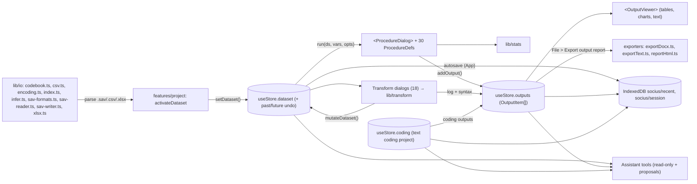
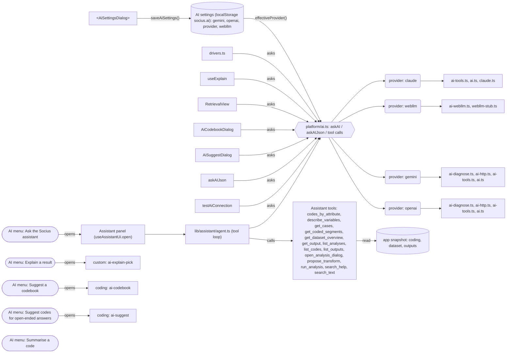
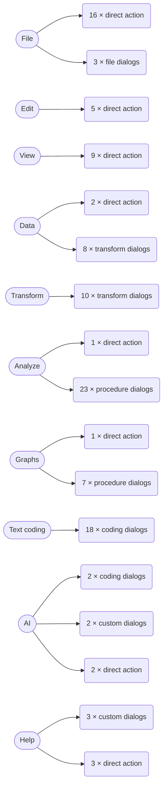

# Socius: big-picture diagrams

Generated by `npm run map` from the same graph as [[GRAPH_REPORT]]; the boxes are real modules, components and store members. Open in Obsidian or on GitHub to see the diagrams rendered.

## 1. App shell → tabs → features

```mermaid
flowchart TB
  n0(["#lt;App#gt;"])
  n1("src/main.tsx")
  n1 -->|"mounts"| n0
  subgraph shell["App shell (always mounted)"]
  n2["#lt;CommandPaletteHost#gt;"]
  n3["#lt;DialogHost#gt;"]
  n4["#lt;GuardedDialogs#gt;"]
  n5["#lt;PanelBoundary#gt;"]
  n6["#lt;QuietBoundary#gt;"]
  n7["#lt;BusyOverlay#gt;"]
  n8["#lt;ConfirmHost#gt;"]
  n9["#lt;DropOverlay#gt;"]
  n10["#lt;Toasts#gt;"]
  n11["#lt;Sidebar#gt;"]
  n12["#lt;TopBar#gt;"]
  n13["#lt;AiSettingsHost#gt;"]
  n14["#lt;AssistantRoot#gt;"]
  end
  subgraph tabs["Main tabs (useStore.tab)"]
  n15["#lt;SampleBanner#gt;"]
  n16["#lt;Welcome#gt;"]
  n17["#lt;CodingWorkspace#gt;"]
  n18["#lt;DataView#gt;"]
  n19["#lt;VariableView#gt;"]
  n20["#lt;OutputViewer#gt;"]
  end
  n0 --> n2
  n0 --> n3
  n0 --> n4
  n0 --> n5
  n0 --> n6
  n0 --> n7
  n0 --> n8
  n0 --> n9
  n0 --> n10
  n0 --> n11
  n0 --> n12
  n0 --> n15
  n0 --> n16
  n0 --> n13
  n0 --> n14
  n0 --> n17
  n0 --> n18
  n0 --> n19
  n0 --> n20
  n21["#lt;MenuBar#gt;"]
  n12 --> n21
  n22{{"menus: File · Edit · View · Data · Transform · Analyze · Graphs · Text coding · AI · Help"}}
  n21 -->|"useMenus()"| n22
  n23("coding dialogs")
  n3 -->|"dialog.kind"| n23
  n24["#lt;CodingDialog#gt;"]
  n23 --> n24
  n25("custom dialogs")
  n3 -->|"dialog.kind"| n25
  n26("file dialogs")
  n3 -->|"dialog.kind"| n26
  n27("procedure dialogs")
  n3 -->|"dialog.kind"| n27
  n28["#lt;ProcedureDialog#gt;"]
  n27 --> n28
  n29("transform dialogs")
  n3 -->|"dialog.kind"| n29
  n30["#lt;TransformDialog#gt;"]
  n29 --> n30
```

What `<App>` mounts, which dialog kinds the host routes, and the menubar model.

## 2. Data flow: import → store → procedures → output → export

Store writers of `addOutput` come from areas: features/analysis, features/coding, features/data, features/transform.

## 3. AI flow: settings → providers → features and assistant tools

## 4. Menus: what their commands do

Commands grouped by effect (details per command in [[GRAPH_REPORT]] and the Menus notes).

