# Automatic crawl findings

Generated 2026-09-24 18:21 UTC from commit `5111ec4` by `node scripts/crawl/run.mjs`. 50 state/viewport/theme combinations, 2150 menu items chosen, 1486 dialogs opened, 367 dialog controls and 282 toolbar buttons clicked, 3625 layout checks.

Partial run: 38 findings are carried over from the fuller run of 2026-09-24 15:41 UTC (50 combinations, 2150 menu items, 1486 dialogs).

This file is regenerated on every run. The curated, prioritised list with reproduction steps is [UI-BUGS.md](UI-BUGS.md); this is the raw, deduplicated output behind it. Keys are stable across runs, so `crawl-diff.md` can tell what was fixed.

## Summary

| Area | P0 | P1 | P2 | Total |
|---|---:|---:|---:|---:|
| variables | 0 | 1 | 3 | 4 |
| transforms | 0 | 6 | 3 | 9 |
| analysis dialogs | 0 | 12 | 1 | 13 |
| charts | 0 | 2 | 0 | 2 |
| text coding | 0 | 0 | 1 | 1 |
| AI/assistant | 0 | 4 | 4 | 8 |
| shell/menus/search/help | 0 | 5 | 0 | 5 |
| mobile | 0 | 2 | 0 | 2 |
| **All** | **0** | **32** | **12** | **44** |

By check: focus-return 23, layout-shift 5, occluded 4, focus-ring 3, contrast 2, dead-control 1, focus-escape 1, focus-trap 1, menu-hover 1, popup-offscreen 1, overflow-text 1, slow 1.

## Owner reports (automated verdicts)

- **ai** (first-visit @ 1440x900 light): partly. 3 provider choices: On this computerFree, private / Google GeminiFree key / Other serviceAdvanced; Google GeminiFree key: test with a made-up key → Not connected. The steps below show where it failed and what to do.; Other serviceAdvanced: test with a made-up key → Not connected. The steps below show where it failed and what to do.
- **ai** (first-visit @ 400x800 light): partly. dialog opened
- **home** (sample @ 1440x900 light): not reproduced. logo is <button>; click: DOM changed (http://127.0.0.1:4396/socius/\|tab-data → http://127.0.0.1:4396/socius/\|); guide link "Open Socius" → ../ (200); guide opened as http://127.0.0.1:4396/socius/guide: "Open Socius" resolves to http://127.0.0.1:4396/socius/; "Open Socius" in the guide → http://127.0.0.1:4396/socius/ (app loads)
- **home** (sample @ 400x800 light): not reproduced. logo is <button>; click: DOM changed (http://127.0.0.1:4396/socius/\|tab-data → http://127.0.0.1:4396/socius/\|); guide link "Open Socius" → ../ (200); guide opened as http://127.0.0.1:4396/socius/guide: "Open Socius" resolves to http://127.0.0.1:4396/socius/; "Open Socius" in the guide → http://127.0.0.1:4396/socius/ (app loads)
- **menu-hover** (first-visit @ 1440x900 light): not reproduced. menubar and menu item highlight followed the pointer after clicking every tab
- **menu-hover** (sample @ 1440x900 light): not reproduced. menubar and menu item highlight followed the pointer after clicking every tab

## P1 (32)

### Focus is lost after closing: Define variable properties

- Key `5690330b41` · check `focus-return` · area **variables** · seen in 4 combinations · (carried over from the previous run: outside this run's scope)
- What: after closing "Define variable properties" with Escape, keyboard focus goes to the page body (keyboard users lose their place)
- Element: `dialog "Define variable properties"`
- Where: sample @ 1440x900 dark; sample @ 1440x900 light; weighted @ 1440x900 dark; weighted @ 1440x900 light
- Steps (sample @ 1440x900 light):
  1. Viewport 1440×900, light theme (View > Theme)
  2. Open the app in a fresh browser profile
  3. Welcome screen: click "Load sample survey"
  4. Click the "Variable View" tab
  5. Right-click a Variable View row
  6. Choose "Define variable properties..."
  7. Dialog "Define variable properties" is open

### Focus is lost after closing: Define variable properties

- Key `8f8e3eae09` · check `focus-return` · area **transforms** · seen in 12 combinations · (carried over from the previous run: outside this run's scope)
- What: after closing "Merge Files: Add Cases" with Escape, keyboard focus goes to the page body (keyboard users lose their place)
- Element: `dialog "Define variable properties"`
- Where: sample @ 400x800 dark; sample @ 400x800 light; weighted @ 1024x768 dark; weighted @ 1024x768 light; weighted @ 1280x800 dark; weighted @ 1280x800 light; weighted @ 1440x900 dark; weighted @ 1440x900 light; +4 more
- Steps (weighted @ 1440x900 light):
  1. Viewport 1440×900, light theme (View > Theme)
  2. Open the app in a fresh browser profile
  3. Welcome screen: click "Load sample survey"
  4. Data > Weight cases...: Weight cases by wt, OK
  5. Data > Select cases...: condition "age >= 30", OK
  6. Click the "Data" menu
  7. Point at "Merge files"
  8. Point at "Merge files"
  9. Choose Data > Merge files > Add cases...
  10. Dialog "Merge Files: Add Cases" is open
  11. In "Merge Files: Add Cases", click "Choose the second file"

### Focus is lost after closing: Sort Cases

- Key `b5ca5b08c9` · check `focus-return` · area **transforms** · seen in 12 combinations · (carried over from the previous run: outside this run's scope)
- What: after closing "Sort Cases" with Escape, keyboard focus goes to the page body (keyboard users lose their place)
- Element: `dialog "Sort Cases"`
- Where: sample @ 400x800 dark; sample @ 400x800 light; weighted @ 1024x768 dark; weighted @ 1024x768 light; weighted @ 1280x800 dark; weighted @ 1280x800 light; weighted @ 1440x900 dark; weighted @ 1440x900 light; +4 more
- Steps (weighted @ 1440x900 light):
  1. Viewport 1440×900, light theme (View > Theme)
  2. Open the app in a fresh browser profile
  3. Welcome screen: click "Load sample survey"
  4. Data > Weight cases...: Weight cases by wt, OK
  5. Data > Select cases...: condition "age >= 30", OK
  6. Click the "Data" menu
  7. Choose Data > Sort cases...
  8. Dialog "Sort Cases" is open
  9. In "Sort Cases", change the "resp_id (Respondent ID) city (City) area (Type of " drop-down
  10. In "Sort Cases", change the "Ascending Descending" drop-down
  11. In "Sort Cases", click "Add"
  12. In "Sort Cases", click "Descending"
  13. In "Sort Cases", click "Ascending"

### Focus is lost after closing: Select Cases

- Key `49f77dbe90` · check `focus-return` · area **transforms** · seen in 8 combinations · (carried over from the previous run: outside this run's scope)
- What: after closing "Select Cases" with Escape, keyboard focus goes to the page body (keyboard users lose their place)
- Element: `dialog "Select Cases"`
- Where: weighted @ 1024x768 dark; weighted @ 1024x768 light; weighted @ 1280x800 dark; weighted @ 1280x800 light; weighted @ 1440x900 dark; weighted @ 1440x900 light; weighted @ 768x1024 dark; weighted @ 768x1024 light
- Steps (weighted @ 1440x900 light):
  1. Viewport 1440×900, light theme (View > Theme)
  2. Open the app in a fresh browser profile
  3. Welcome screen: click "Load sample survey"
  4. Data > Weight cases...: Weight cases by wt, OK
  5. Data > Select cases...: condition "age >= 30", OK
  6. Click the "Data" menu
  7. Choose Data > Select cases...
  8. Dialog "Select Cases" is open
  9. In "Select Cases", click the "Functions" tab
  10. In "Select Cases", click "sc"

### Focus is lost after closing: Weight Cases

- Key `9a5a6e5fd7` · check `focus-return` · area **transforms** · seen in 8 combinations · (carried over from the previous run: outside this run's scope)
- What: after closing "Weight Cases" with Escape, keyboard focus goes to the page body (keyboard users lose their place)
- Element: `dialog "Weight Cases"`
- Where: weighted @ 1024x768 dark; weighted @ 1024x768 light; weighted @ 1280x800 dark; weighted @ 1280x800 light; weighted @ 1440x900 dark; weighted @ 1440x900 light; weighted @ 768x1024 dark; weighted @ 768x1024 light
- Steps (weighted @ 1440x900 light):
  1. Viewport 1440×900, light theme (View > Theme)
  2. Open the app in a fresh browser profile
  3. Welcome screen: click "Load sample survey"
  4. Data > Weight cases...: Weight cases by wt, OK
  5. Data > Select cases...: condition "age >= 30", OK
  6. Click the "Data" menu
  7. Choose Data > Weight cases...
  8. Dialog "Weight Cases" is open
  9. In "Weight Cases", click "wt"

### Focus is lost after closing: Aggregate

- Key `74e890fd92` · check `focus-return` · area **transforms** · seen in 8 combinations · (carried over from the previous run: outside this run's scope)
- What: after closing "Aggregate" with Escape, keyboard focus goes to the page body (keyboard users lose their place)
- Element: `dialog "Aggregate"`
- Where: weighted @ 1024x768 dark; weighted @ 1024x768 light; weighted @ 1280x800 dark; weighted @ 1280x800 light; weighted @ 1440x900 dark; weighted @ 1440x900 light; weighted @ 768x1024 dark; weighted @ 768x1024 light
- Steps (weighted @ 1440x900 light):
  1. Viewport 1440×900, light theme (View > Theme)
  2. Open the app in a fresh browser profile
  3. Welcome screen: click "Load sample survey"
  4. Data > Weight cases...: Weight cases by wt, OK
  5. Data > Select cases...: condition "age >= 30", OK
  6. Click the "Data" menu
  7. Choose Data > Aggregate...
  8. Dialog "Aggregate" is open
  9. In "Aggregate", click "All"
  10. In "Aggregate", click "None"
  11. In "Aggregate", click "resp_id Respondent ID"
  12. In "Aggregate", click "city City"
  13. In "Aggregate", change the "Mean Sum Number of cases (weighted) Number of case" drop-down
  14. In "Aggregate", change the "resp_id (Respondent ID) city (City) area (Type of " drop-down
  15. In "Aggregate", click "Add"
  16. In "Aggregate", click "ag"

### Focus is lost after closing: Compute Variable

- Key `332305785e` · check `focus-return` · area **transforms** · seen in 2 combinations · (carried over from the previous run: outside this run's scope)
- What: after closing "Compute Variable" with Escape, keyboard focus goes to the page body (keyboard users lose their place)
- Element: `dialog "Compute Variable"`
- Where: sample @ 400x800 dark; sample @ 400x800 light
- Steps (sample @ 400x800 light):
  1. Viewport 400×800, light theme (View > Theme)
  2. Open the app in a fresh browser profile
  3. Welcome screen: click "Load sample survey"
  4. Tap the "Menu" button
  5. Tap the "Menu" button, then "Transform"
  6. Tap "Transform > Compute variable..."
  7. Dialog "Compute Variable" is open
  8. In "Compute Variable", click the "Functions" tab

### Focus is lost after closing: Frequencies

- Key `6e5c987637` · check `focus-return` · area **analysis dialogs** · seen in 12 combinations · (carried over from the previous run: outside this run's scope)
- What: after closing "Frequencies" with Escape, keyboard focus goes to the page body (keyboard users lose their place)
- Element: `dialog "Frequencies"`
- Where: sample @ 400x800 dark; sample @ 400x800 light; weighted @ 1024x768 dark; weighted @ 1024x768 light; weighted @ 1280x800 dark; weighted @ 1280x800 light; weighted @ 1440x900 dark; weighted @ 1440x900 light; +4 more
- Steps (weighted @ 1440x900 light):
  1. Viewport 1440×900, light theme (View > Theme)
  2. Open the app in a fresh browser profile
  3. Welcome screen: click "Load sample survey"
  4. Data > Weight cases...: Weight cases by wt, OK
  5. Data > Select cases...: condition "age >= 30", OK
  6. Click the "Analyze" menu
  7. Point at "Descriptive Statistics"
  8. Point at "Descriptive Statistics"
  9. Choose Analyze > Descriptive Statistics > Frequencies...
  10. Dialog "Frequencies" is open
  11. In "Frequencies", click the "Statistics" tab
  12. In "Frequencies", click the "Charts" tab
  13. In "Frequencies", click "When to use this"
  14. In "Frequencies", change the "None Bar chart Pie chart Histogram" drop-down
  15. In "Frequencies", click "Show normal curve on histogram"
  16. In "Frequencies", change the "Frequencies Percentages" drop-down

### Focus is lost after closing: Descriptives

- Key `55ff113d0f` · check `focus-return` · area **analysis dialogs** · seen in 12 combinations · (carried over from the previous run: outside this run's scope)
- What: after closing "Descriptives" with Escape, keyboard focus goes to the page body (keyboard users lose their place)
- Element: `dialog "Descriptives"`
- Where: sample @ 400x800 dark; sample @ 400x800 light; weighted @ 1024x768 dark; weighted @ 1024x768 light; weighted @ 1280x800 dark; weighted @ 1280x800 light; weighted @ 1440x900 dark; weighted @ 1440x900 light; +4 more
- Steps (weighted @ 1440x900 light):
  1. Viewport 1440×900, light theme (View > Theme)
  2. Open the app in a fresh browser profile
  3. Welcome screen: click "Load sample survey"
  4. Data > Weight cases...: Weight cases by wt, OK
  5. Data > Select cases...: condition "age >= 30", OK
  6. Click the "Analyze" menu
  7. Point at "Descriptive Statistics"
  8. Point at "Descriptive Statistics"
  9. Choose Analyze > Descriptive Statistics > Descriptives...
  10. Dialog "Descriptives" is open
  11. In "Descriptives", click the "Distribution" tab
  12. In "Descriptives", click the "Display" tab
  13. In "Descriptives", click "When to use this"
  14. In "Descriptives", change the "Variable list Ascending means Descending means" drop-down

### Focus is lost after closing: Explore

- Key `c68899bae9` · check `focus-return` · area **analysis dialogs** · seen in 12 combinations · (carried over from the previous run: outside this run's scope)
- What: after closing "Explore" with Escape, keyboard focus goes to the page body (keyboard users lose their place)
- Element: `dialog "Explore"`
- Where: sample @ 400x800 dark; sample @ 400x800 light; weighted @ 1024x768 dark; weighted @ 1024x768 light; weighted @ 1280x800 dark; weighted @ 1280x800 light; weighted @ 1440x900 dark; weighted @ 1440x900 light; +4 more
- Steps (weighted @ 1440x900 light):
  1. Viewport 1440×900, light theme (View > Theme)
  2. Open the app in a fresh browser profile
  3. Welcome screen: click "Load sample survey"
  4. Data > Weight cases...: Weight cases by wt, OK
  5. Data > Select cases...: condition "age >= 30", OK
  6. Click the "Analyze" menu
  7. Point at "Descriptive Statistics"
  8. Point at "Descriptive Statistics"
  9. Choose Analyze > Descriptive Statistics > Explore...
  10. Dialog "Explore" is open
  11. In "Explore", click the "Plots" tab
  12. In "Explore", click the "Options" tab
  13. In "Explore", click "When to use this"
  14. In "Explore", change the "Exclude cases listwise Exclude cases pairwise" drop-down

### Focus is lost after closing: Crosstabs

- Key `50d0b08121` · check `focus-return` · area **analysis dialogs** · seen in 8 combinations · (carried over from the previous run: outside this run's scope)
- What: after closing "Crosstabs" with Escape, keyboard focus goes to the page body (keyboard users lose their place)
- Element: `dialog "Crosstabs"`
- Where: weighted @ 1024x768 dark; weighted @ 1024x768 light; weighted @ 1280x800 dark; weighted @ 1280x800 light; weighted @ 1440x900 dark; weighted @ 1440x900 light; weighted @ 768x1024 dark; weighted @ 768x1024 light
- Steps (weighted @ 1440x900 light):
  1. Viewport 1440×900, light theme (View > Theme)
  2. Open the app in a fresh browser profile
  3. Welcome screen: click "Load sample survey"
  4. Data > Weight cases...: Weight cases by wt, OK
  5. Data > Select cases...: condition "age >= 30", OK
  6. Click the "Analyze" menu
  7. Point at "Descriptive Statistics"
  8. Point at "Descriptive Statistics"
  9. Choose Analyze > Descriptive Statistics > Crosstabs...
  10. Dialog "Crosstabs" is open
  11. In "Crosstabs", click the "Statistics" tab
  12. In "Crosstabs", click the "Exact" tab
  13. In "Crosstabs", click the "Charts" tab
  14. In "Crosstabs", click "When to use this"
  15. In "Crosstabs", click "Clustered bar chart"

### Focus is lost after closing: Means

- Key `775b387f18` · check `focus-return` · area **analysis dialogs** · seen in 8 combinations · (carried over from the previous run: outside this run's scope)
- What: after closing "Means" with Escape, keyboard focus goes to the page body (keyboard users lose their place)
- Element: `dialog "Means"`
- Where: weighted @ 1024x768 dark; weighted @ 1024x768 light; weighted @ 1280x800 dark; weighted @ 1280x800 light; weighted @ 1440x900 dark; weighted @ 1440x900 light; weighted @ 768x1024 dark; weighted @ 768x1024 light
- Steps (weighted @ 1440x900 light):
  1. Viewport 1440×900, light theme (View > Theme)
  2. Open the app in a fresh browser profile
  3. Welcome screen: click "Load sample survey"
  4. Data > Weight cases...: Weight cases by wt, OK
  5. Data > Select cases...: condition "age >= 30", OK
  6. Click the "Analyze" menu
  7. Point at "Compare Means"
  8. Point at "Compare Means"
  9. Choose Analyze > Compare Means > Means...
  10. Dialog "Means" is open
  11. In "Means", click the "Statistics for first layer" tab
  12. In "Means", click "When to use this"
  13. In "Means", click "ANOVA table and eta"

### Focus is lost after closing: One-Sample T Test

- Key `b70a7ba8e7` · check `focus-return` · area **analysis dialogs** · seen in 8 combinations · (carried over from the previous run: outside this run's scope)
- What: after closing "One-Sample T Test" with Escape, keyboard focus goes to the page body (keyboard users lose their place)
- Element: `dialog "One-Sample T Test"`
- Where: weighted @ 1024x768 dark; weighted @ 1024x768 light; weighted @ 1280x800 dark; weighted @ 1280x800 light; weighted @ 1440x900 dark; weighted @ 1440x900 light; weighted @ 768x1024 dark; weighted @ 768x1024 light
- Steps (weighted @ 1440x900 light):
  1. Viewport 1440×900, light theme (View > Theme)
  2. Open the app in a fresh browser profile
  3. Welcome screen: click "Load sample survey"
  4. Data > Weight cases...: Weight cases by wt, OK
  5. Data > Select cases...: condition "age >= 30", OK
  6. Click the "Analyze" menu
  7. Point at "Compare Means"
  8. Point at "Compare Means"
  9. Choose Analyze > Compare Means > One-Sample T Test...
  10. Dialog "One-Sample T Test" is open
  11. In "One-Sample T Test", click "Estimate effect sizes"
  12. In "One-Sample T Test", change the "Exclude cases analysis by analysis Exclude cases l" drop-down

### Focus is lost after closing: Independent-Samples T Test

- Key `1bc2d4311c` · check `focus-return` · area **analysis dialogs** · seen in 8 combinations · (carried over from the previous run: outside this run's scope)
- What: after closing "Mann-Whitney U (2 independent samples)" with Escape, keyboard focus goes to the page body (keyboard users lose their place)
- Element: `dialog "Independent-Samples T Test"`
- Where: weighted @ 1024x768 dark; weighted @ 1024x768 light; weighted @ 1280x800 dark; weighted @ 1280x800 light; weighted @ 1440x900 dark; weighted @ 1440x900 light; weighted @ 768x1024 dark; weighted @ 768x1024 light
- Steps (weighted @ 1440x900 light):
  1. Viewport 1440×900, light theme (View > Theme)
  2. Open the app in a fresh browser profile
  3. Welcome screen: click "Load sample survey"
  4. Data > Weight cases...: Weight cases by wt, OK
  5. Data > Select cases...: condition "age >= 30", OK
  6. Click the "Analyze" menu
  7. Point at "Nonparametric Tests"
  8. Point at "Nonparametric Tests"
  9. Choose Analyze > Nonparametric Tests > Mann-Whitney U (2 independent samples)...
  10. Dialog "Mann-Whitney U (2 independent samples)" is open

### Focus is lost after closing: One-Way ANOVA

- Key `b95a1f456f` · check `focus-return` · area **analysis dialogs** · seen in 8 combinations · (carried over from the previous run: outside this run's scope)
- What: after closing "One-Way ANOVA" with Escape, keyboard focus goes to the page body (keyboard users lose their place)
- Element: `dialog "One-Way ANOVA"`
- Where: weighted @ 1024x768 dark; weighted @ 1024x768 light; weighted @ 1280x800 dark; weighted @ 1280x800 light; weighted @ 1440x900 dark; weighted @ 1440x900 light; weighted @ 768x1024 dark; weighted @ 768x1024 light
- Steps (weighted @ 1440x900 light):
  1. Viewport 1440×900, light theme (View > Theme)
  2. Open the app in a fresh browser profile
  3. Welcome screen: click "Load sample survey"
  4. Data > Weight cases...: Weight cases by wt, OK
  5. Data > Select cases...: condition "age >= 30", OK
  6. Click the "Analyze" menu
  7. Point at "Compare Means"
  8. Point at "Compare Means"
  9. Choose Analyze > Compare Means > One-Way ANOVA...
  10. Dialog "One-Way ANOVA" is open
  11. In "One-Way ANOVA", click the "Post hoc" tab
  12. In "One-Way ANOVA", click the "Options" tab
  13. In "One-Way ANOVA", click "When to use this"
  14. In "One-Way ANOVA", click "Means plot"

### Focus is lost after closing: Linear Regression

- Key `ceb3fdaa08` · check `focus-return` · area **analysis dialogs** · seen in 8 combinations · (carried over from the previous run: outside this run's scope)
- What: after closing "Linear Regression" with Escape, keyboard focus goes to the page body (keyboard users lose their place)
- Element: `dialog "Linear Regression"`
- Where: weighted @ 1024x768 dark; weighted @ 1024x768 light; weighted @ 1280x800 dark; weighted @ 1280x800 light; weighted @ 1440x900 dark; weighted @ 1440x900 light; weighted @ 768x1024 dark; weighted @ 768x1024 light
- Steps (weighted @ 1440x900 light):
  1. Viewport 1440×900, light theme (View > Theme)
  2. Open the app in a fresh browser profile
  3. Welcome screen: click "Load sample survey"
  4. Data > Weight cases...: Weight cases by wt, OK
  5. Data > Select cases...: condition "age >= 30", OK
  6. Click the "Analyze" menu
  7. Point at "Regression"
  8. Point at "Regression"
  9. Choose Analyze > Regression > Linear Regression...
  10. Dialog "Linear Regression" is open
  11. In "Linear Regression", click the "Categorical predictors" tab
  12. In "Linear Regression", click the "Statistics" tab
  13. In "Linear Regression", click the "Residuals" tab
  14. In "Linear Regression", click "When to use this"
  15. In "Linear Regression", click "Durbin-Watson"
  16. In "Linear Regression", click "Casewise diagnostics"

### Focus is lost after closing: Ordinal Regression

- Key `f1d018bc76` · check `focus-return` · area **analysis dialogs** · seen in 8 combinations · (carried over from the previous run: outside this run's scope)
- What: after closing "Ordinal Regression" with Escape, keyboard focus goes to the page body (keyboard users lose their place)
- Element: `dialog "Ordinal Regression"`
- Where: weighted @ 1024x768 dark; weighted @ 1024x768 light; weighted @ 1280x800 dark; weighted @ 1280x800 light; weighted @ 1440x900 dark; weighted @ 1440x900 light; weighted @ 768x1024 dark; weighted @ 768x1024 light
- Steps (weighted @ 1440x900 light):
  1. Viewport 1440×900, light theme (View > Theme)
  2. Open the app in a fresh browser profile
  3. Welcome screen: click "Load sample survey"
  4. Data > Weight cases...: Weight cases by wt, OK
  5. Data > Select cases...: condition "age >= 30", OK
  6. Click the "Analyze" menu
  7. Point at "Regression"
  8. Point at "Regression"
  9. Choose Analyze > Regression > Ordinal Regression...
  10. Dialog "Ordinal Regression" is open
  11. In "Ordinal Regression", click the "Output" tab
  12. In "Ordinal Regression", click "When to use this"
  13. In "Ordinal Regression", click "Test of parallel lines"
  14. In "Ordinal Regression", click "Goodness-of-fit statistics"

### Focus is lost after closing: Binomial

- Key `d6df83c262` · check `focus-return` · area **analysis dialogs** · seen in 8 combinations · (carried over from the previous run: outside this run's scope)
- What: after closing "Binomial" with Escape, keyboard focus goes to the page body (keyboard users lose their place)
- Element: `dialog "Binomial"`
- Where: weighted @ 1024x768 dark; weighted @ 1024x768 light; weighted @ 1280x800 dark; weighted @ 1280x800 light; weighted @ 1440x900 dark; weighted @ 1440x900 light; weighted @ 768x1024 dark; weighted @ 768x1024 light
- Steps (weighted @ 1440x900 light):
  1. Viewport 1440×900, light theme (View > Theme)
  2. Open the app in a fresh browser profile
  3. Welcome screen: click "Load sample survey"
  4. Data > Weight cases...: Weight cases by wt, OK
  5. Data > Select cases...: condition "age >= 30", OK
  6. Click the "Analyze" menu
  7. Point at "Nonparametric Tests"
  8. Point at "Nonparametric Tests"
  9. Choose Analyze > Nonparametric Tests > Binomial...
  10. Dialog "Binomial" is open
  11. In "Binomial", click "When to use this"
  12. In "Binomial", change the "Get from data (two values) Cut point (<= cut point" drop-down

### Focus is lost after closing: Factor Analysis

- Key `7cefa30231` · check `focus-return` · area **analysis dialogs** · seen in 8 combinations · (carried over from the previous run: outside this run's scope)
- What: after closing "Factor Analysis" with Escape, keyboard focus goes to the page body (keyboard users lose their place)
- Element: `dialog "Factor Analysis"`
- Where: weighted @ 1024x768 dark; weighted @ 1024x768 light; weighted @ 1280x800 dark; weighted @ 1280x800 light; weighted @ 1440x900 dark; weighted @ 1440x900 light; weighted @ 768x1024 dark; weighted @ 768x1024 light
- Steps (weighted @ 1440x900 light):
  1. Viewport 1440×900, light theme (View > Theme)
  2. Open the app in a fresh browser profile
  3. Welcome screen: click "Load sample survey"
  4. Data > Weight cases...: Weight cases by wt, OK
  5. Data > Select cases...: condition "age >= 30", OK
  6. Click the "Analyze" menu
  7. Point at "Dimension Reduction"
  8. Point at "Dimension Reduction"
  9. Choose Analyze > Dimension Reduction > Factor Analysis...
  10. Dialog "Factor Analysis" is open
  11. In "Factor Analysis", click the "Rotation" tab
  12. In "Factor Analysis", click the "Descriptives" tab
  13. In "Factor Analysis", click the "Options" tab
  14. In "Factor Analysis", click "When to use this"
  15. In "Factor Analysis", click "Sorted by size"
  16. In "Factor Analysis", click "Suppress small coefficients"

### Control covered by another element: div.toast.toast-success

- Key `a1aab9bb7b` · check `occluded` · area **charts** · seen in 8 combinations · (carried over from the previous run: outside this run's scope)
- What: div.toast.toast-success covers 5 control(s) so they cannot be clicked: "Copy with formatting for Word ", "Explain this result in plain l", "Move up", "Move down", "Delete"
- Element: `div#root > div.app > div.toasts > div.toast.toast-success`
- Where: analyses @ 1024x768 dark; analyses @ 1024x768 light; analyses @ 1280x800 dark; analyses @ 1280x800 light; analyses @ 400x800 dark; analyses @ 400x800 light; analyses @ 768x1024 dark; analyses @ 768x1024 light
- Steps (analyses @ 1280x800 light):
  1. Viewport 1280×800, light theme (View > Theme)
  2. Open the app in a fresh browser profile
  3. Welcome screen: click "Load sample survey"
  4. Run Analyze > Descriptive Statistics > Frequencies... (Frequencies of educ)
  5. Run Analyze > Descriptive Statistics > Crosstabs... (Crosstabs civic_meet × migrant)
  6. Run Analyze > Compare Means > Independent-Samples T Test... (Independent-samples t test of life_sat by migrant)
  7. Run Analyze > Regression > Linear Regression... (Linear regression life_sat on age and yrs_nbhd)
  8. Run Graphs > Bar Chart... (Bar chart of educ)
  9. In Output, go to result 2 ("Frequencies")
- Screenshot: 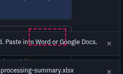

### Control does nothing when clicked: Check again

- Key `fd5559a6c2` · check `dead-control` · area **charts** · seen in 1 combination · (carried over from the previous run: outside this run's scope)
- What: "Check again" was clicked and nothing happened: no DOM change, no dialog, no message, no download or file picker
- Where: analyses @ 1440x900 light
- Steps (analyses @ 1440x900 light):
  1. Viewport 1440×900, light theme (View > Theme)
  2. Open the app in a fresh browser profile
  3. Welcome screen: click "Load sample survey"
  4. Run Analyze > Descriptive Statistics > Frequencies... (Frequencies of educ)
  5. Run Analyze > Descriptive Statistics > Crosstabs... (Crosstabs civic_meet × migrant)
  6. Run Analyze > Compare Means > Independent-Samples T Test... (Independent-samples t test of life_sat by migrant)
  7. Run Analyze > Regression > Linear Regression... (Linear regression life_sat on age and yrs_nbhd)
  8. Run Graphs > Bar Chart... (Bar chart of educ)
  9. In Output, go to result 1 ("Frequencies")
  10. Click "AI Explain with AI" (.ov-doc article:nth-of-type(1))
  11. Dialog "AI assistant" is open
  12. In "AI assistant", click "ai-provider"
  13. In "AI assistant", click "ai-webllm-model"
  14. In "AI assistant", click "Browser storage (downloaded models)"
  15. In "AI assistant", click "Check again"
- Screenshot: 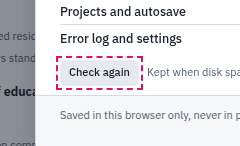

### Control covered by another element: aside.as-panel

- Key `47abc011a4` · check `occluded` · area **AI/assistant** · seen in 8 combinations
- What: aside.as-panel covers 2 control(s) so they cannot be clicked: "Open project A .socius.json fi", "New dataset Empty: type or pas"
- Element: `div#root > div.app > aside.as-panel`
- Where: analyses @ 768x1024 dark; analyses @ 768x1024 light; coding @ 768x1024 dark; coding @ 768x1024 light; first-visit @ 768x1024 dark; first-visit @ 768x1024 light; sample @ 768x1024 dark; sample @ 768x1024 light
- Steps (first-visit @ 768x1024 light):
  1. Viewport 768×1024, light theme (View > Theme)
  2. Open the app in a fresh browser profile (no saved session)
  3. Press Ctrl+J
- Screenshot: 

### Control covered by another element: button.as-fab

- Key `70323501a1` · check `occluded` · area **AI/assistant** · seen in 4 combinations · (carried over from the previous run: outside this run's scope)
- What: button.as-fab covers 1 control(s) so they cannot be clicked: "Code actions"
- Element: `div#root > div.app > button.as-fab`
- Where: coding @ 1024x768 dark; coding @ 1024x768 light; coding @ 768x1024 dark; coding @ 768x1024 light
- Steps (coding @ 1024x768 light):
  1. Viewport 1024×768, light theme (View > Theme)
  2. Open the app in a fresh browser profile
  3. Welcome screen: click "Load sample survey"
  4. Click the "Text coding" tab
  5. Click "Explore a worked example"
- Screenshot: 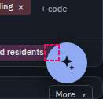

### Escape does not close the top dialog: Assistant

- Key `ca2ccd59c2` · check `focus-escape` · area **AI/assistant** · seen in 2 combinations · (carried over from the previous run: outside this run's scope)
- What: Escape does not close the assistant panel
- Element: `.as-panel`
- Where: first-visit @ 400x800 dark; first-visit @ 400x800 light
- Steps (first-visit @ 400x800 light):
  1. Viewport 400×800, light theme (View > Theme)
  2. Open the app in a fresh browser profile (no saved session)
  3. Press Ctrl+J
  4. Type a question in the assistant and click Send
  5. Press Escape
- Screenshot: 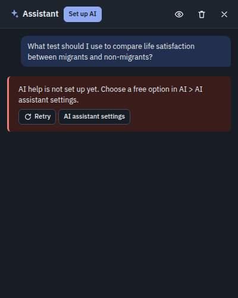

### Focus is lost after closing: AI assistant

- Key `883a6ecdf6` · check `focus-return` · area **AI/assistant** · seen in 1 combination · (carried over from the previous run: outside this run's scope)
- What: after closing "AI assistant" with Escape, keyboard focus goes to the page body (keyboard users lose their place)
- Element: `dialog "AI assistant"`
- Where: coding @ 400x800 light
- Steps (coding @ 400x800 light):
  1. Viewport 400×800, light theme (View > Theme)
  2. Open the app in a fresh browser profile
  3. Welcome screen: click "Load sample survey"
  4. Click the "Text coding" tab
  5. Click "Explore a worked example"
  6. Tap the "Menu" button
  7. Tap the "Menu" button, then "AI"
  8. Tap "AI > Explain a result..."
  9. Dialog "AI assistant" is open

### Dialog does not keep keyboard focus inside: Error log

- Key `36bac9131a` · check `focus-trap` · area **shell/menus/search/help** · seen in 7 combinations · (carried over from the previous run: outside this run's scope)
- What: pressing Tab in "Error log" moves focus out of the dialog to the page body
- Element: `dialog "Error log"`
- Where: first-visit @ 1024x768 dark; first-visit @ 1024x768 light; first-visit @ 1280x800 dark; first-visit @ 1280x800 light; first-visit @ 1440x900 dark; first-visit @ 768x1024 dark; first-visit @ 768x1024 light
- Steps (first-visit @ 1440x900 dark):
  1. Viewport 1440×900, dark theme (View > Theme)
  2. Open the app in a fresh browser profile (no saved session)
  3. Click the "Help" menu
  4. Choose Help > Error log...
  5. Dialog "Error log" is open
- Screenshot: 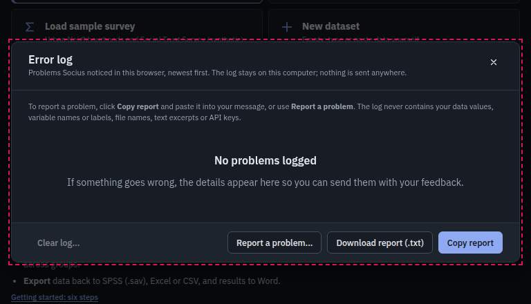

### Focus is lost after closing: Getting started

- Key `7a21d13d28` · check `focus-return` · area **shell/menus/search/help** · seen in 6 combinations · (carried over from the previous run: outside this run's scope)
- What: after closing "Getting started" with Escape, keyboard focus goes to the page body (keyboard users lose their place)
- Element: `dialog "Getting started"`
- Where: analyses @ 400x800 dark; analyses @ 400x800 light; first-visit @ 400x800 dark; first-visit @ 400x800 light; sample @ 400x800 dark; sample @ 400x800 light
- Steps (first-visit @ 400x800 light):
  1. Viewport 400×800, light theme (View > Theme)
  2. Open the app in a fresh browser profile (no saved session)
  3. Tap the "Menu" button
  4. Tap the "Menu" button, then "Help"
  5. Tap "Help > Getting started"
  6. Dialog "Getting started" is open

### Focus is lost after closing: Keyboard shortcuts

- Key `a4d949e0c1` · check `focus-return` · area **shell/menus/search/help** · seen in 6 combinations · (carried over from the previous run: outside this run's scope)
- What: after closing "Keyboard shortcuts" with Escape, keyboard focus goes to the page body (keyboard users lose their place)
- Element: `dialog "Keyboard shortcuts"`
- Where: analyses @ 400x800 dark; analyses @ 400x800 light; first-visit @ 400x800 dark; first-visit @ 400x800 light; sample @ 400x800 dark; sample @ 400x800 light
- Steps (first-visit @ 400x800 light):
  1. Viewport 400×800, light theme (View > Theme)
  2. Open the app in a fresh browser profile (no saved session)
  3. Tap the "Menu" button
  4. Tap the "Menu" button, then "Help"
  5. Tap "Help > Keyboard shortcuts"
  6. Dialog "Keyboard shortcuts" is open

### Focus is lost after closing: Clear all output?

- Key `c6177158a6` · check `focus-return` · area **shell/menus/search/help** · seen in 2 combinations · (carried over from the previous run: outside this run's scope)
- What: after closing "Clear all output?" with Escape, keyboard focus goes to the page body (keyboard users lose their place)
- Element: `dialog "Clear all output?"`
- Where: analyses @ 400x800 dark; analyses @ 400x800 light
- Steps (analyses @ 400x800 light):
  1. Viewport 400×800, light theme (View > Theme)
  2. Open the app in a fresh browser profile
  3. Welcome screen: click "Load sample survey"
  4. Run Analyze > Descriptive Statistics > Frequencies... (Frequencies of educ)
  5. Run Analyze > Descriptive Statistics > Crosstabs... (Crosstabs civic_meet × migrant)
  6. Run Analyze > Compare Means > Independent-Samples T Test... (Independent-samples t test of life_sat by migrant)
  7. Run Analyze > Regression > Linear Regression... (Linear regression life_sat on age and yrs_nbhd)
  8. Run Graphs > Bar Chart... (Bar chart of educ)
  9. Tap the "Menu" button
  10. Tap the "Menu" button, then "Edit"
  11. Tap "Edit > Clear output..."
  12. Dialog "Clear all output?" is open

### Menu highlight does not follow the pointer: Analyze

- Key `569f8f706b` · check `menu-hover` · area **shell/menus/search/help** · seen in 2 combinations · (carried over from the previous run: outside this run's scope)
- What: after moving with the arrow keys and then pointing at "Regression", 2 items look highlighted at once ("Regression", "Nonparametric Tests"): the keyboard highlight does not follow the pointer
- Element: `menu Analyze (keyboard then mouse)`
- Where: sample @ 1280x800 dark; weighted @ 768x1024 light
- Steps (sample @ 1280x800 dark):
  1. Viewport 1280×800, dark theme (View > Theme)
  2. Open the app in a fresh browser profile
  3. Welcome screen: click "Load sample survey"
  4. Click the "Analyze" menu
- Screenshot: 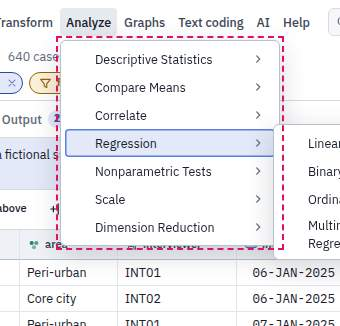

### Control covered by another element: aside.as-panel

- Key `eeb3fffd34` · check `occluded` · area **mobile** · seen in 8 combinations
- What: aside.as-panel covers 16 control(s) so they cannot be clicked: "Socius home: start screen and ", "Menu", "Search Socius", "AI help: not set up", "Undo", "Redo", "Theme: Dark", "Data View"
- Element: `div#root > div.app > aside.as-panel`
- Where: analyses @ 400x800 dark; analyses @ 400x800 light; coding @ 400x800 dark; coding @ 400x800 light; first-visit @ 400x800 dark; first-visit @ 400x800 light; sample @ 400x800 dark; sample @ 400x800 light
- Steps (first-visit @ 400x800 light):
  1. Viewport 400×800, light theme (View > Theme)
  2. Open the app in a fresh browser profile (no saved session)
  3. Press Ctrl+J
- Screenshot: 

### Popup extends off-screen: Coder 1 (coding now) Show only my segmen

- Key `4c67f30977` · check `popup-offscreen` · area **mobile** · seen in 1 combination · (carried over from the previous run: outside this run's scope)
- What: popup extends past the viewport (-113,216 to 107,332 in 400×800)
- Element: `main#main.main > div.pane > div.cw > div.cw-toolbar > div.row.cw-actions > div.cw-menu > div.cw-menu-list`
- Where: coding @ 400x800 light
- Steps (coding @ 400x800 light):
  1. Viewport 400×800, light theme (View > Theme)
  2. Open the app in a fresh browser profile
  3. Welcome screen: click "Load sample survey"
  4. Click the "Text coding" tab
  5. Click "Explore a worked example"
  6. Click "Coder: Coder 1 ▾" (.cw-toolbar)
- Screenshot: 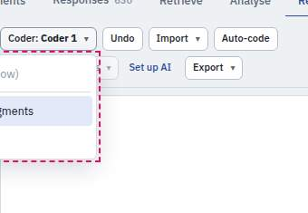

## P2 (12)

### Text is clipped: 34 variables

- Key `8f7b3bf2be` · check `overflow-text` · area **variables** · seen in 12 combinations · (carried over from the previous run: outside this run's scope)
- What: text truncated with an ellipsis (57px hidden) and no tooltip with the full text
- Element: `div.app > div.workspace.with-sidebar > main#main.main > div.pane.pane-data > div.varview > div.view-toolbar > span.toolbar-status`
- Where: analyses @ 1024x768 dark; analyses @ 1024x768 light; analyses @ 768x1024 dark; analyses @ 768x1024 light; coding @ 1024x768 dark; coding @ 1024x768 light; coding @ 768x1024 dark; coding @ 768x1024 light; +4 more
- Steps (sample @ 1024x768 light):
  1. Viewport 1024×768, light theme (View > Theme)
  2. Open the app in a fresh browser profile
  3. Welcome screen: click "Load sample survey"
  4. Click the "View" menu
  5. Choose View > Variable View
- Screenshot: 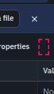

### Low text contrast: None

- Key `d6f224de0e` · check `contrast` · area **variables** · seen in 4 combinations · (carried over from the previous run: outside this run's scope)
- What: text contrast 2.40:1 (rgb(138, 148, 163) on rgb(219, 228, 247))
- Element: `div.pane.pane-data > div.varview > div.vv-scroll > div > div.vv-row.is-sel > div.vv-cell.vv-missing > span.vv-text.faint`
- Where: sample @ 1440x900 dark; sample @ 1440x900 light; weighted @ 1440x900 dark; weighted @ 1440x900 light
- Steps (sample @ 1440x900 light):
  1. Viewport 1440×900, light theme (View > Theme)
  2. Open the app in a fresh browser profile
  3. Welcome screen: click "Load sample survey"
  4. Right-click a Data View cell
  5. Choose "Variable properties"
- Screenshot: 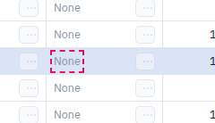

### Low text contrast: None

- Key `bf86e9a861` · check `contrast` · area **variables** · seen in 4 combinations · (carried over from the previous run: outside this run's scope)
- What: text contrast 2.40:1 (rgb(138, 148, 163) on rgb(219, 228, 247))
- Element: `div.pane.pane-data > div.varview > div.vv-scroll > div > div.vv-row.is-sel > div.vv-cell.vv-values > span.vv-text.faint`
- Where: sample @ 1440x900 dark; sample @ 1440x900 light; weighted @ 1440x900 dark; weighted @ 1440x900 light
- Steps (sample @ 1440x900 light):
  1. Viewport 1440×900, light theme (View > Theme)
  2. Open the app in a fresh browser profile
  3. Welcome screen: click "Load sample survey"
  4. Right-click a Data View column header
  5. Choose "Variable properties"
- Screenshot: 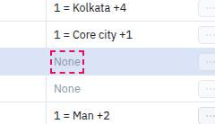

### No visible focus indicator: Search

- Key `e58968f07a` · check `focus-ring` · area **transforms** · seen in 16 combinations · (carried over from the previous run: outside this run's scope)
- What: in "Select Cases", "Search" gets keyboard focus (Tab) but nothing on screen shows it
- Element: `div.modal.modal-wide > div.modal-body > div.dialog-cols.dialog-cols-main > div.expr-helper > div.varpicker-search > input.varpicker-input`
- Where: sample @ 1024x768 dark; sample @ 1024x768 light; sample @ 1280x800 dark; sample @ 1280x800 light; sample @ 1440x900 dark; sample @ 1440x900 light; sample @ 768x1024 dark; sample @ 768x1024 light; +8 more
- Steps (sample @ 1440x900 light):
  1. Viewport 1440×900, light theme (View > Theme)
  2. Open the app in a fresh browser profile
  3. Welcome screen: click "Load sample survey"
  4. Click the "Data" menu
  5. Choose Data > Select cases...
  6. Dialog "Select Cases" is open
- Screenshot: 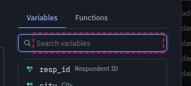

### No visible focus indicator: Search

- Key `fba5184b70` · check `focus-ring` · area **transforms** · seen in 10 combinations · (carried over from the previous run: outside this run's scope)
- What: in "Compute Variable", "Search" gets keyboard focus (Tab) but nothing on screen shows it
- Element: `div.modal.modal-wide > div.modal-body > div.dialog-cols.dialog-cols-main > div.expr-helper > div.varpicker-search > input.varpicker-input`
- Where: sample @ 1024x768 dark; sample @ 1024x768 light; sample @ 1280x800 dark; sample @ 1280x800 light; sample @ 1440x900 dark; sample @ 1440x900 light; sample @ 400x800 dark; sample @ 400x800 light; +2 more
- Steps (sample @ 1440x900 light):
  1. Viewport 1440×900, light theme (View > Theme)
  2. Open the app in a fresh browser profile
  3. Welcome screen: click "Load sample survey"
  4. Click the "Transform" menu
  5. Choose Transform > Compute variable...
  6. Dialog "Compute Variable" is open
- Screenshot: 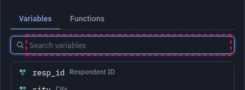

### No visible focus indicator: Search Weight variable

- Key `b5e4183caf` · check `focus-ring` · area **transforms** · seen in 8 combinations · (carried over from the previous run: outside this run's scope)
- What: in "Weight Cases", "Search Weight variable" gets keyboard focus (Tab) but nothing on screen shows it
- Element: `div.modal > div.modal-body > div.stack > div.varpicker > div.varpicker-search > input.varpicker-input`
- Where: weighted @ 1024x768 dark; weighted @ 1024x768 light; weighted @ 1280x800 dark; weighted @ 1280x800 light; weighted @ 1440x900 dark; weighted @ 1440x900 light; weighted @ 768x1024 dark; weighted @ 768x1024 light
- Steps (weighted @ 1440x900 light):
  1. Viewport 1440×900, light theme (View > Theme)
  2. Open the app in a fresh browser profile
  3. Welcome screen: click "Load sample survey"
  4. Data > Weight cases...: Weight cases by wt, OK
  5. Data > Select cases...: condition "age >= 30", OK
  6. Click the "Data" menu
  7. Choose Data > Weight cases...
  8. Dialog "Weight Cases" is open
- Screenshot: 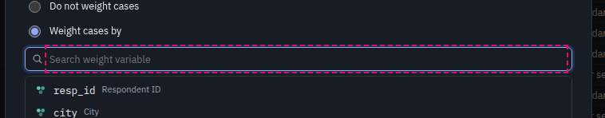

### Slow response to a click: Options

- Key `3c4e70e088` · check `slow` · area **analysis dialogs** · seen in 1 combination · (carried over from the previous run: outside this run's scope)
- What: took 2057ms to respond (first DOM change or longest main-thread task); total step 15324ms
- Where: weighted @ 768x1024 dark
- Steps (weighted @ 768x1024 dark):
  1. Viewport 768×1024, dark theme (View > Theme)
  2. Open the app in a fresh browser profile
  3. Welcome screen: click "Load sample survey"
  4. Data > Weight cases...: Weight cases by wt, OK
  5. Data > Select cases...: condition "age >= 30", OK
  6. Click the "Analyze" menu
  7. Point at "Descriptive Statistics"
  8. Point at "Descriptive Statistics"
  9. Choose Analyze > Descriptive Statistics > Explore...
  10. Dialog "Explore" is open
  11. In "Explore", click the "Plots" tab
  12. In "Explore", click the "Options" tab
- Screenshot: 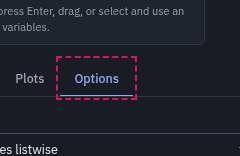

### Layout shifts when something opens: More ▾

- Key `0edb065a53` · check `layout-shift` · area **text coding** · seen in 2 combinations · (carried over from the previous run: outside this run's scope)
- What: opening it moved the page behind: .cw-toolbar 0,138,400,115 → 0,-235,400,115
- Element: `.cw-toolbar`
- Where: coding @ 400x800 dark; coding @ 400x800 light
- Steps (coding @ 400x800 light):
  1. Viewport 400×800, light theme (View > Theme)
  2. Open the app in a fresh browser profile
  3. Welcome screen: click "Load sample survey"
  4. Click the "Text coding" tab
  5. Click "Explore a worked example"
  6. In Text coding, click the "Retrieve" view
  7. Click "More ▾" (.cw-main)
- Screenshot: 

### Layout shifts when something opens: AI > Ask the Socius assistant...

- Key `c5bfe0c4d6` · check `layout-shift` · area **AI/assistant** · seen in 8 combinations
- What: opening it moved the page behind: .main 252,114,1188,786 → 252,114,748,786; .view-toolbar 252,155,1188,40 → 252,155,748,40; .grid-scroll 252,195,1188,705 → 252,195,748,705
- Element: `.main, .view-toolbar, .grid-scroll`
- Where: sample @ 1024x768 dark; sample @ 1024x768 light; sample @ 1280x800 dark; sample @ 1280x800 light; sample @ 1440x900 dark; sample @ 1440x900 light; weighted @ 1440x900 dark; weighted @ 1440x900 light
- Steps (sample @ 1440x900 light):
  1. Viewport 1440×900, light theme (View > Theme)
  2. Open the app in a fresh browser profile
  3. Welcome screen: click "Load sample survey"
  4. Press Ctrl+J
- Screenshot: 

### Layout shifts when something opens: AI > Ask the Socius assistant...

- Key `8a66c05409` · check `layout-shift` · area **AI/assistant** · seen in 6 combinations
- What: opening it moved the page behind: .main 0,114,1440,786 → 0,114,1000,786; .ov-toolbar 0,114,1440,45 → 0,114,1000,45
- Element: `.main, .ov-toolbar`
- Where: analyses @ 1024x768 dark; analyses @ 1024x768 light; analyses @ 1280x800 dark; analyses @ 1280x800 light; analyses @ 1440x900 dark; analyses @ 1440x900 light
- Steps (analyses @ 1440x900 light):
  1. Viewport 1440×900, light theme (View > Theme)
  2. Open the app in a fresh browser profile
  3. Welcome screen: click "Load sample survey"
  4. Run Analyze > Descriptive Statistics > Frequencies... (Frequencies of educ)
  5. Run Analyze > Descriptive Statistics > Crosstabs... (Crosstabs civic_meet × migrant)
  6. Run Analyze > Compare Means > Independent-Samples T Test... (Independent-samples t test of life_sat by migrant)
  7. Run Analyze > Regression > Linear Regression... (Linear regression life_sat on age and yrs_nbhd)
  8. Run Graphs > Bar Chart... (Bar chart of educ)
  9. Press Ctrl+J
- Screenshot: 

### Layout shifts when something opens: AI > Ask the Socius assistant...

- Key `acb5e9b308` · check `layout-shift` · area **AI/assistant** · seen in 6 combinations
- What: opening it moved the page behind: .main 0,114,1440,786 → 0,114,1000,786; .cw-toolbar 0,114,1440,37 → 0,114,1000,81
- Element: `.main, .cw-toolbar`
- Where: coding @ 1024x768 dark; coding @ 1024x768 light; coding @ 1280x800 dark; coding @ 1280x800 light; coding @ 1440x900 dark; coding @ 1440x900 light
- Steps (coding @ 1440x900 light):
  1. Viewport 1440×900, light theme (View > Theme)
  2. Open the app in a fresh browser profile
  3. Welcome screen: click "Load sample survey"
  4. Click the "Text coding" tab
  5. Click "Explore a worked example"
  6. Press Ctrl+J
- Screenshot: 

### Layout shifts when something opens: AI > Ask the Socius assistant...

- Key `d38198ca1a` · check `layout-shift` · area **AI/assistant** · seen in 6 combinations
- What: opening it moved the page behind: .main 0,82,1440,818 → 0,82,1000,818
- Element: `.main`
- Where: first-visit @ 1024x768 dark; first-visit @ 1024x768 light; first-visit @ 1280x800 dark; first-visit @ 1280x800 light; first-visit @ 1440x900 dark; first-visit @ 1440x900 light
- Steps (first-visit @ 1440x900 light):
  1. Viewport 1440×900, light theme (View > Theme)
  2. Open the app in a fresh browser profile (no saved session)
  3. Press Ctrl+J
- Screenshot: 
