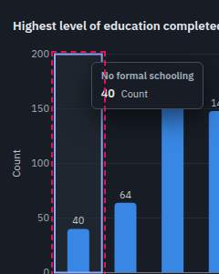
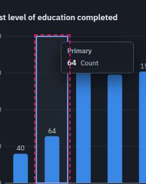
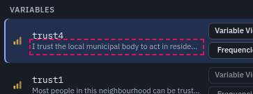

# Automatic crawl findings

Generated 2026-09-24 20:07 UTC from commit `07c5b4b` by `node scripts/crawl/run.mjs`. 50 state/viewport/theme combinations, 2780 menu items chosen, 2060 dialogs opened, 3668 dialog controls and 934 toolbar buttons clicked, 6453 layout checks.

This file is regenerated on every run. The curated, prioritised list with reproduction steps is [UI-BUGS.md](UI-BUGS.md); this is the raw, deduplicated output behind it. Keys are stable across runs, so `crawl-diff.md` can tell what was fixed.

## Summary

| Area | P0 | P1 | P2 | Total |
|---|---:|---:|---:|---:|
| output | 0 | 0 | 2 | 2 |
| text coding | 0 | 0 | 1 | 1 |
| AI/assistant | 0 | 1 | 4 | 5 |
| mobile | 0 | 1 | 2 | 3 |
| **All** | **0** | **2** | **9** | **11** |

By check: layout-shift 5, occluded 2, focus-ring 2, overflow-text 2.

## Owner reports (automated verdicts)

- **ai** (first-visit @ 1440x900 light): partly. 3 provider choices: On this computerFree, private / Google GeminiFree key / Other serviceAdvanced; Google GeminiFree key: test with a made-up key → Not connected. The steps below show where it failed and what to do.; Other serviceAdvanced: test with a made-up key → Not connected. The steps below show where it failed and what to do.
- **ai** (first-visit @ 400x800 light): partly. dialog opened
- **home** (sample @ 1440x900 light): not reproduced. logo is <button>; click: DOM changed (http://127.0.0.1:4533/socius/\|tab-data → http://127.0.0.1:4533/socius/\|); guide link "Open Socius" → ../ (200); guide opened as http://127.0.0.1:4533/socius/guide: "Open Socius" resolves to http://127.0.0.1:4533/socius/; "Open Socius" in the guide → http://127.0.0.1:4533/socius/ (app loads)
- **home** (sample @ 400x800 light): not reproduced. logo is <button>; click: DOM changed (http://127.0.0.1:4533/socius/\|tab-data → http://127.0.0.1:4533/socius/\|); guide link "Open Socius" → ../ (200); guide opened as http://127.0.0.1:4533/socius/guide: "Open Socius" resolves to http://127.0.0.1:4533/socius/; "Open Socius" in the guide → http://127.0.0.1:4533/socius/ (app loads)
- **menu-hover** (first-visit @ 1440x900 light): not reproduced. menubar and menu item highlight followed the pointer after clicking every tab
- **menu-hover** (sample @ 1440x900 light): not reproduced. menubar and menu item highlight followed the pointer after clicking every tab
- **rename** (sample @ 1440x900 light): not reproduced. double-click the Name cell, select all, type a new name, press Enter: OK; click the Name cell once and start typing, press Enter: OK; select the Name cell and press F2, type, press Tab: OK; double-click the Name cell, type a new name, then click another row: OK; double-click the Name cell, type a new name, then click the Data View tab: OK; double-click the Name cell, type a new name, then open a menu: OK; invalid name: error shown
- **rename** (sample @ 400x800 light): not reproduced. double-click the Name cell, select all, type a new name, press Enter: OK; click the Name cell once and start typing, press Enter: OK; select the Name cell and press F2, type, press Tab: OK; double-click the Name cell, type a new name, then click another row: OK; double-click the Name cell, type a new name, then click the Data View tab: OK; double-click the Name cell, type a new name, then open a menu: OK; invalid name: error shown

## P1 (2)

### Control covered by another element: aside.as-panel

- Key `47abc011a4` · check `occluded` · area **AI/assistant** · seen in 10 combinations
- What: aside.as-panel covers 2 control(s) so they cannot be clicked: "Open project A .socius.json fi", "New dataset Empty: type or pas"
- Element: `div#root > div.app > aside.as-panel`
- Where: analyses @ 768x1024 dark; analyses @ 768x1024 light; coding @ 768x1024 dark; coding @ 768x1024 light; first-visit @ 768x1024 dark; first-visit @ 768x1024 light; sample @ 768x1024 dark; sample @ 768x1024 light; +2 more
- Steps (first-visit @ 768x1024 light):
  1. Viewport 768×1024, light theme (View > Theme)
  2. Open the app in a fresh browser profile (no saved session)
  3. Press Ctrl+J
- Screenshot: 

### Control covered by another element: aside.as-panel

- Key `eeb3fffd34` · check `occluded` · area **mobile** · seen in 10 combinations
- What: aside.as-panel covers 16 control(s) so they cannot be clicked: "Socius home: start screen and ", "Menu", "Search Socius", "AI help: the on-device model (", "Undo", "Redo", "Theme: Dark", "Data View"
- Element: `div#root > div.app > aside.as-panel`
- Where: analyses @ 400x800 dark; analyses @ 400x800 light; coding @ 400x800 dark; coding @ 400x800 light; first-visit @ 400x800 dark; first-visit @ 400x800 light; sample @ 400x800 dark; sample @ 400x800 light; +2 more
- Steps (first-visit @ 400x800 light):
  1. Viewport 400×800, light theme (View > Theme)
  2. Open the app in a fresh browser profile (no saved session)
  3. Press Ctrl+J
- Screenshot: 

## P2 (9)

### No visible focus indicator: No formal schooling: 40

- Key `72330bc36a` · check `focus-ring` · area **output** · seen in 4 combinations
- What: "No formal schooling: 40" receives keyboard focus (Tab stop 29) with no visible focus indicator
- Element: `div.oi-body > div.ob.ob-chart > figure.ob-chart > div.chart > svg.chart-svg > rect.chart-hit`
- Where: analyses @ 400x800 dark; analyses @ 400x800 light; analyses @ 768x1024 dark; analyses @ 768x1024 light
- Steps (analyses @ 400x800 light):
  1. Viewport 400×800, light theme (View > Theme)
  2. Open the app in a fresh browser profile
  3. Welcome screen: click "Load sample survey"
  4. Run Analyze > Descriptive Statistics > Frequencies... (Frequencies of educ)
  5. Run Analyze > Descriptive Statistics > Crosstabs... (Crosstabs civic_meet × migrant)
  6. Run Analyze > Compare Means > Independent-Samples T Test... (Independent-samples t test of life_sat by migrant)
  7. Run Analyze > Regression > Linear Regression... (Linear regression life_sat on age and yrs_nbhd)
  8. Run Graphs > Bar Chart... (Bar chart of educ)
  9. Press Tab repeatedly from the top of the page
- Screenshot: 

### No visible focus indicator: Primary: 64

- Key `2f702f7345` · check `focus-ring` · area **output** · seen in 4 combinations
- What: "Primary: 64" receives keyboard focus (Tab stop 30) with no visible focus indicator
- Element: `div.oi-body > div.ob.ob-chart > figure.ob-chart > div.chart > svg.chart-svg > rect.chart-hit`
- Where: analyses @ 400x800 dark; analyses @ 400x800 light; analyses @ 768x1024 dark; analyses @ 768x1024 light
- Steps (analyses @ 400x800 light):
  1. Viewport 400×800, light theme (View > Theme)
  2. Open the app in a fresh browser profile
  3. Welcome screen: click "Load sample survey"
  4. Run Analyze > Descriptive Statistics > Frequencies... (Frequencies of educ)
  5. Run Analyze > Descriptive Statistics > Crosstabs... (Crosstabs civic_meet × migrant)
  6. Run Analyze > Compare Means > Independent-Samples T Test... (Independent-samples t test of life_sat by migrant)
  7. Run Analyze > Regression > Linear Regression... (Linear regression life_sat on age and yrs_nbhd)
  8. Run Graphs > Bar Chart... (Bar chart of educ)
  9. Press Tab repeatedly from the top of the page
- Screenshot: 

### Layout shifts when something opens: More ▾

- Key `0edb065a53` · check `layout-shift` · area **text coding** · seen in 2 combinations
- What: opening it moved the page behind: .cw-toolbar 0,138,400,115 → 0,-235,400,115
- Element: `.cw-toolbar`
- Where: coding @ 400x800 dark; coding @ 400x800 light
- Steps (coding @ 400x800 light):
  1. Viewport 400×800, light theme (View > Theme)
  2. Open the app in a fresh browser profile
  3. Welcome screen: click "Load sample survey"
  4. Click the "Text coding" tab
  5. Click "Explore a worked example"
  6. In Text coding, click the "Retrieve" view
  7. Click "More ▾" (.cw-main)
- Screenshot: 

### Layout shifts when something opens: AI > Ask the Socius assistant...

- Key `c5bfe0c4d6` · check `layout-shift` · area **AI/assistant** · seen in 12 combinations
- What: opening it moved the page behind: .main 252,114,1188,786 → 252,114,748,786; .view-toolbar 252,155,1188,40 → 252,155,748,40; .grid-scroll 252,195,1188,705 → 252,195,748,705
- Element: `.main, .view-toolbar, .grid-scroll`
- Where: sample @ 1024x768 dark; sample @ 1024x768 light; sample @ 1280x800 dark; sample @ 1280x800 light; sample @ 1440x900 dark; sample @ 1440x900 light; weighted @ 1024x768 dark; weighted @ 1024x768 light; +4 more
- Steps (sample @ 1440x900 light):
  1. Viewport 1440×900, light theme (View > Theme)
  2. Open the app in a fresh browser profile
  3. Welcome screen: click "Load sample survey"
  4. Press Ctrl+J
- Screenshot: 

### Layout shifts when something opens: AI > Ask the Socius assistant...

- Key `8a66c05409` · check `layout-shift` · area **AI/assistant** · seen in 6 combinations
- What: opening it moved the page behind: .main 0,114,1440,786 → 0,114,1000,786; .ov-toolbar 0,114,1440,45 → 0,114,1000,45
- Element: `.main, .ov-toolbar`
- Where: analyses @ 1024x768 dark; analyses @ 1024x768 light; analyses @ 1280x800 dark; analyses @ 1280x800 light; analyses @ 1440x900 dark; analyses @ 1440x900 light
- Steps (analyses @ 1440x900 light):
  1. Viewport 1440×900, light theme (View > Theme)
  2. Open the app in a fresh browser profile
  3. Welcome screen: click "Load sample survey"
  4. Run Analyze > Descriptive Statistics > Frequencies... (Frequencies of educ)
  5. Run Analyze > Descriptive Statistics > Crosstabs... (Crosstabs civic_meet × migrant)
  6. Run Analyze > Compare Means > Independent-Samples T Test... (Independent-samples t test of life_sat by migrant)
  7. Run Analyze > Regression > Linear Regression... (Linear regression life_sat on age and yrs_nbhd)
  8. Run Graphs > Bar Chart... (Bar chart of educ)
  9. Press Ctrl+J
- Screenshot: 

### Layout shifts when something opens: AI > Ask the Socius assistant...

- Key `acb5e9b308` · check `layout-shift` · area **AI/assistant** · seen in 6 combinations
- What: opening it moved the page behind: .main 0,114,1440,786 → 0,114,1000,786; .cw-toolbar 0,114,1440,37 → 0,114,1000,81
- Element: `.main, .cw-toolbar`
- Where: coding @ 1024x768 dark; coding @ 1024x768 light; coding @ 1280x800 dark; coding @ 1280x800 light; coding @ 1440x900 dark; coding @ 1440x900 light
- Steps (coding @ 1440x900 light):
  1. Viewport 1440×900, light theme (View > Theme)
  2. Open the app in a fresh browser profile
  3. Welcome screen: click "Load sample survey"
  4. Click the "Text coding" tab
  5. Click "Explore a worked example"
  6. Press Ctrl+J
- Screenshot: 

### Layout shifts when something opens: AI > Ask the Socius assistant...

- Key `d38198ca1a` · check `layout-shift` · area **AI/assistant** · seen in 6 combinations
- What: opening it moved the page behind: .main 0,82,1440,818 → 0,82,1000,818
- Element: `.main`
- Where: first-visit @ 1024x768 dark; first-visit @ 1024x768 light; first-visit @ 1280x800 dark; first-visit @ 1280x800 light; first-visit @ 1440x900 dark; first-visit @ 1440x900 light
- Steps (first-visit @ 1440x900 light):
  1. Viewport 1440×900, light theme (View > Theme)
  2. Open the app in a fresh browser profile (no saved session)
  3. Press Ctrl+J
- Screenshot: 

### Text is clipped: I trust the local municipal body to act in residents' intere

- Key `bf5ae283d5` · check `overflow-text` · area **mobile** · seen in 6 combinations
- What: text truncated with an ellipsis (49px hidden) and no tooltip with the full text
- Element: `div.palette-backdrop > div.palette > div#_r_4_-list.palette-list > div.palette-section > div#_r_4_-opt-0.palette-item > span.palette-text > span.palette-detail`
- Where: coding @ 400x800 dark; coding @ 400x800 light; sample @ 400x800 dark; sample @ 400x800 light; weighted @ 400x800 dark; weighted @ 400x800 light
- Steps (sample @ 400x800 light):
  1. Viewport 400×800, light theme (View > Theme)
  2. Open the app in a fresh browser profile
  3. Welcome screen: click "Load sample survey"
  4. Press Ctrl+K
  5. Type "trust"
- Screenshot: 

### Text is clipped: I trust the local municipal body to act in residents' intere

- Key `ed5485ecd3` · check `overflow-text` · area **mobile** · seen in 2 combinations
- What: text truncated with an ellipsis (49px hidden) and no tooltip with the full text
- Element: `div.palette-backdrop > div.palette > div#_r_a_-list.palette-list > div.palette-section > div#_r_a_-opt-0.palette-item > span.palette-text > span.palette-detail`
- Where: analyses @ 400x800 dark; analyses @ 400x800 light
- Steps (analyses @ 400x800 light):
  1. Viewport 400×800, light theme (View > Theme)
  2. Open the app in a fresh browser profile
  3. Welcome screen: click "Load sample survey"
  4. Run Analyze > Descriptive Statistics > Frequencies... (Frequencies of educ)
  5. Run Analyze > Descriptive Statistics > Crosstabs... (Crosstabs civic_meet × migrant)
  6. Run Analyze > Compare Means > Independent-Samples T Test... (Independent-samples t test of life_sat by migrant)
  7. Run Analyze > Regression > Linear Regression... (Linear regression life_sat on age and yrs_nbhd)
  8. Run Graphs > Bar Chart... (Bar chart of educ)
  9. Press Ctrl+K
  10. Type "trust"
- Screenshot: 
