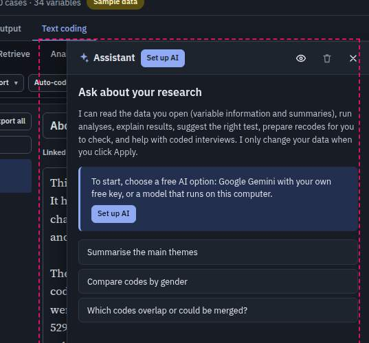
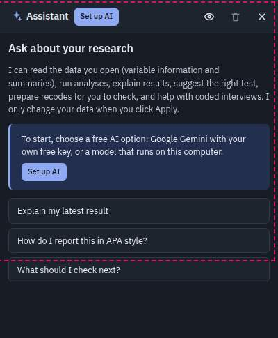
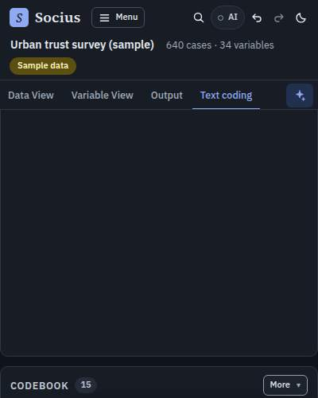
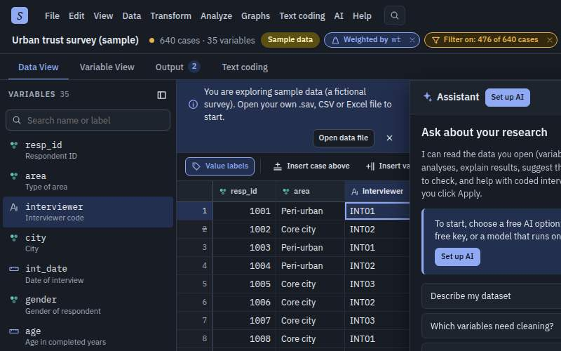
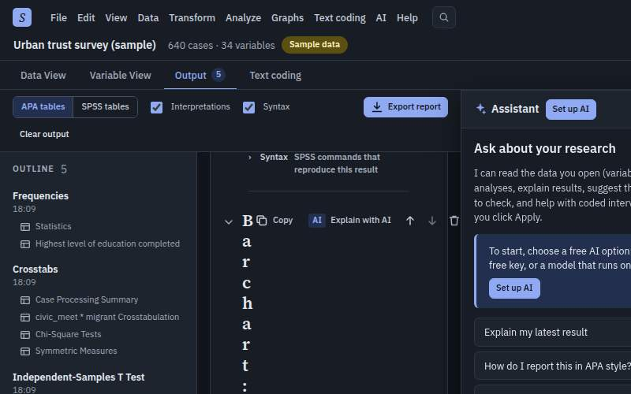
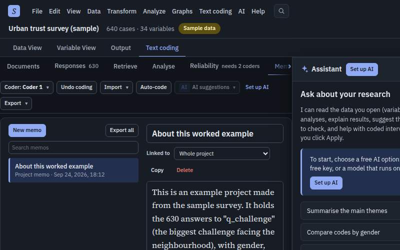
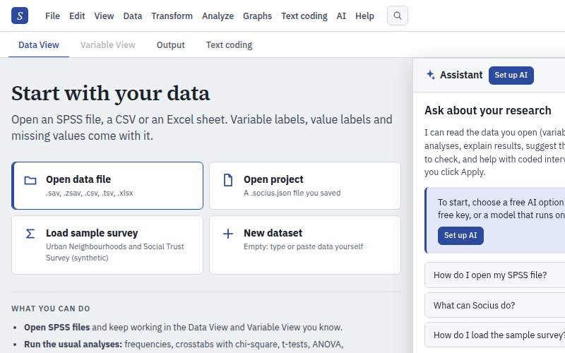

# Automatic crawl findings

Generated 2026-09-24 20:19 UTC from commit `7d81a51` by `node scripts/crawl/run.mjs`. 1 state/viewport/theme combinations, 41 menu items chosen, 25 dialogs opened, 27 dialog controls and 46 toolbar buttons clicked, 82 layout checks.

Partial run: 6 findings are carried over from the fuller run of 2026-09-24 20:07 UTC (50 combinations, 2780 menu items, 2060 dialogs).

This file is regenerated on every run. The curated, prioritised list with reproduction steps is [UI-BUGS.md](UI-BUGS.md); this is the raw, deduplicated output behind it. Keys are stable across runs, so `crawl-diff.md` can tell what was fixed.

## Summary

| Area | P0 | P1 | P2 | Total |
|---|---:|---:|---:|---:|
| text coding | 0 | 0 | 1 | 1 |
| AI/assistant | 0 | 1 | 4 | 5 |
| mobile | 0 | 1 | 0 | 1 |
| **All** | **0** | **2** | **5** | **7** |

By check: layout-shift 5, occluded 2.

## P1 (2)

### Control covered by another element: aside.as-panel

- Key `47abc011a4` · check `occluded` · area **AI/assistant** · seen in 10 combinations · (carried over from the previous run: outside this run's scope)
- What: aside.as-panel covers 2 control(s) so they cannot be clicked: "Open project A .socius.json fi", "New dataset Empty: type or pas"
- Element: `div#root > div.app > aside.as-panel`
- Where: analyses @ 768x1024 dark; analyses @ 768x1024 light; coding @ 768x1024 dark; coding @ 768x1024 light; first-visit @ 768x1024 dark; first-visit @ 768x1024 light; sample @ 768x1024 dark; sample @ 768x1024 light; +2 more
- Steps (first-visit @ 768x1024 light):
  1. Viewport 768×1024, light theme (View > Theme)
  2. Open the app in a fresh browser profile (no saved session)
  3. Press Ctrl+J
- Screenshot: 

### Control covered by another element: aside.as-panel

- Key `eeb3fffd34` · check `occluded` · area **mobile** · seen in 1 combination
- What: aside.as-panel covers 26 control(s) so they cannot be clicked: "Socius home: start screen and ", "Menu", "Search Socius", "AI help: not set up", "Undo", "Redo", "Theme: Light", "Rename (used as the file name "
- Element: `div#root > div.app > aside.as-panel`
- Where: analyses @ 400x800 light
- Steps (analyses @ 400x800 light):
  1. Viewport 400×800, light theme (View > Theme)
  2. Open the app in a fresh browser profile
  3. Welcome screen: click "Load sample survey"
  4. Run Analyze > Descriptive Statistics > Frequencies... (Frequencies of educ)
  5. Run Analyze > Descriptive Statistics > Crosstabs... (Crosstabs civic_meet × migrant)
  6. Run Analyze > Compare Means > Independent-Samples T Test... (Independent-samples t test of life_sat by migrant)
  7. Run Analyze > Regression > Linear Regression... (Linear regression life_sat on age and yrs_nbhd)
  8. Run Graphs > Bar Chart... (Bar chart of educ)
  9. Press Ctrl+J
- Screenshot: 

## P2 (5)

### Layout shifts when something opens: More ▾

- Key `0edb065a53` · check `layout-shift` · area **text coding** · seen in 2 combinations · (carried over from the previous run: outside this run's scope)
- What: opening it moved the page behind: .cw-toolbar 0,138,400,115 → 0,-235,400,115
- Element: `.cw-toolbar`
- Where: coding @ 400x800 dark; coding @ 400x800 light
- Steps (coding @ 400x800 light):
  1. Viewport 400×800, light theme (View > Theme)
  2. Open the app in a fresh browser profile
  3. Welcome screen: click "Load sample survey"
  4. Click the "Text coding" tab
  5. Click "Explore a worked example"
  6. In Text coding, click the "Retrieve" view
  7. Click "More ▾" (.cw-main)
- Screenshot: 

### Layout shifts when something opens: AI > Ask the Socius assistant...

- Key `c5bfe0c4d6` · check `layout-shift` · area **AI/assistant** · seen in 12 combinations · (carried over from the previous run: outside this run's scope)
- What: opening it moved the page behind: .main 252,114,1188,786 → 252,114,748,786; .view-toolbar 252,155,1188,40 → 252,155,748,40; .grid-scroll 252,195,1188,705 → 252,195,748,705
- Element: `.main, .view-toolbar, .grid-scroll`
- Where: sample @ 1024x768 dark; sample @ 1024x768 light; sample @ 1280x800 dark; sample @ 1280x800 light; sample @ 1440x900 dark; sample @ 1440x900 light; weighted @ 1024x768 dark; weighted @ 1024x768 light; +4 more
- Steps (sample @ 1440x900 light):
  1. Viewport 1440×900, light theme (View > Theme)
  2. Open the app in a fresh browser profile
  3. Welcome screen: click "Load sample survey"
  4. Press Ctrl+J
- Screenshot: 

### Layout shifts when something opens: AI > Ask the Socius assistant...

- Key `8a66c05409` · check `layout-shift` · area **AI/assistant** · seen in 6 combinations · (carried over from the previous run: outside this run's scope)
- What: opening it moved the page behind: .main 0,114,1440,786 → 0,114,1000,786; .ov-toolbar 0,114,1440,45 → 0,114,1000,45
- Element: `.main, .ov-toolbar`
- Where: analyses @ 1024x768 dark; analyses @ 1024x768 light; analyses @ 1280x800 dark; analyses @ 1280x800 light; analyses @ 1440x900 dark; analyses @ 1440x900 light
- Steps (analyses @ 1440x900 light):
  1. Viewport 1440×900, light theme (View > Theme)
  2. Open the app in a fresh browser profile
  3. Welcome screen: click "Load sample survey"
  4. Run Analyze > Descriptive Statistics > Frequencies... (Frequencies of educ)
  5. Run Analyze > Descriptive Statistics > Crosstabs... (Crosstabs civic_meet × migrant)
  6. Run Analyze > Compare Means > Independent-Samples T Test... (Independent-samples t test of life_sat by migrant)
  7. Run Analyze > Regression > Linear Regression... (Linear regression life_sat on age and yrs_nbhd)
  8. Run Graphs > Bar Chart... (Bar chart of educ)
  9. Press Ctrl+J
- Screenshot: 

### Layout shifts when something opens: AI > Ask the Socius assistant...

- Key `acb5e9b308` · check `layout-shift` · area **AI/assistant** · seen in 6 combinations · (carried over from the previous run: outside this run's scope)
- What: opening it moved the page behind: .main 0,114,1440,786 → 0,114,1000,786; .cw-toolbar 0,114,1440,37 → 0,114,1000,81
- Element: `.main, .cw-toolbar`
- Where: coding @ 1024x768 dark; coding @ 1024x768 light; coding @ 1280x800 dark; coding @ 1280x800 light; coding @ 1440x900 dark; coding @ 1440x900 light
- Steps (coding @ 1440x900 light):
  1. Viewport 1440×900, light theme (View > Theme)
  2. Open the app in a fresh browser profile
  3. Welcome screen: click "Load sample survey"
  4. Click the "Text coding" tab
  5. Click "Explore a worked example"
  6. Press Ctrl+J
- Screenshot: 

### Layout shifts when something opens: AI > Ask the Socius assistant...

- Key `d38198ca1a` · check `layout-shift` · area **AI/assistant** · seen in 6 combinations · (carried over from the previous run: outside this run's scope)
- What: opening it moved the page behind: .main 0,82,1440,818 → 0,82,1000,818
- Element: `.main`
- Where: first-visit @ 1024x768 dark; first-visit @ 1024x768 light; first-visit @ 1280x800 dark; first-visit @ 1280x800 light; first-visit @ 1440x900 dark; first-visit @ 1440x900 light
- Steps (first-visit @ 1440x900 light):
  1. Viewport 1440×900, light theme (View > Theme)
  2. Open the app in a fresh browser profile (no saved session)
  3. Press Ctrl+J
- Screenshot: 
