# Socius UI bugs (QA crawl + exploratory testing)

Tested build: commit `5111ec4` plus uncommitted changes, built from the working tree on 2026-09-24 (other agents were editing `src/` during the test, so a few items may already be moving). Served under `/socius/` like GitHub Pages. Chromium (Playwright), fresh browser profile for every state.

How this list was made:

- **Automated crawl** (`scripts/crawl/`): 50 state × viewport × theme combinations (5 states: first visit, sample survey, after Frequencies/Crosstabs/T test/Regression/Bar chart, Text coding worked example, weighted + filtered; 5 viewports 1440×900 to 400×800; light and dark); an earlier full pass also crawled a development React build at 1440×900 (5 more combinations) to catch React warnings. 2,192 menu items chosen, 1,533 dialogs opened and closed, 359 dialog controls and 549 toolbar/Output/coding buttons clicked, 16 right-click menus, 3,908 layout checks, 1,177 dialog focus tests. Raw, deduplicated output: [CRAWL-FINDINGS.md](CRAWL-FINDINGS.md) and [crawl-report.json](crawl-report.json).
- **Exploratory testing** as a sociology researcher (well over 20 minutes, spread across every feature): load the sample, inspect variables, recode age into groups, weight and filter, run frequencies, crosstabs, t test, regression and a bar chart, read and export the output, set up AI, ask the assistant, code open-ended answers with the worked example, and repeat the key flows at tablet and phone width and in dark theme. Those findings are in their own section below.

Priorities: **P0** broken or blocking, **P1** wrong or confusing (a researcher gets stuck, loses work or misreads), **P2** cosmetic or polish.
Each bug has an ID (UI-001...). Where the crawler detects it, the entry names its crawler key; `node scripts/crawl/run.mjs` writes `docs/qa/crawl-diff.md`, which says for each of those IDs whether it is still present.

## Summary

Curated bugs in this file (deduplicated; one entry per root cause):

| Area | P0 | P1 | P2 | Total |
|---|---:|---:|---:|---:|
| data | 0 | 0 | 2 | 2 |
| transforms | 0 | 0 | 2 | 2 |
| analysis dialogs | 0 | 0 | 1 | 1 |
| output | 0 | 1 | 1 | 2 |
| charts | 0 | 0 | 1 | 1 |
| text coding | 0 | 3 | 4 | 7 |
| AI/assistant | 0 | 2 | 2 | 4 |
| shell/menus/search/help | 0 | 4 | 4 | 8 |
| mobile | 0 | 0 | 2 | 2 |
| theme | 0 | 0 | 1 | 1 |
| **All** | **0** | **10** | **20** | **30** |

Raw crawler findings behind them (84 unique keys; the same root cause often has one key per dialog or place, so these counts are higher):

| Area | P0 | P1 | P2 |
|---|---:|---:|---:|
| data | 0 | 2 | 3 |
| variables | 0 | 1 | 2 |
| transforms | 0 | 6 | 3 |
| analysis dialogs | 0 | 12 | 1 |
| output | 0 | 0 | 3 |
| charts | 0 | 8 | 3 |
| text coding | 0 | 7 | 6 |
| AI/assistant | 0 | 7 | 0 |
| shell/menus/search/help | 0 | 16 | 2 |
| mobile | 0 | 2 | 0 |

No P0 was found: no uncaught errors, no console errors or React warnings (also none in the development build), no failed requests for the app's own files, no page that scrolls sideways, and no dialog whose buttons are out of reach at any tested size. The P1s are mostly about focus, things covering controls, and a few flows that silently do the wrong thing.

## Owner's reports, checked on this build

| Report | Verdict | Details |
|---|---|---|
| Variable rename not working in Variable View | **Not reproduced** | Renamed through 7 routes: double-click + type + Enter, click + type, F2 + Tab, typing then clicking another row, typing then switching to Data View, typing then opening a menu, double-click on the Data View column header; also two taps with touch at 400×800. All renamed the variable and the variable list followed. An invalid name ("my var") shows an inline error. If the owner still sees this on the live site, the live build is older than this tree. Crawler scenario `renameVariable` re-checks it every run. |
| Home / redirect button not working | **Fixed in the working tree, with a leftover** | The Socius logo is now a button ("Home: start screen and recent projects") that shows the start screen. The guide's "Open Socius" links resolve and load the app, also when the guide is opened without the trailing slash. Leftover: the tab bar still underlines the previous tab while the start screen is shown (UI-017). |
| Menu hover stuck after clicking a tab; hover does not follow the pointer | **Partly reproduced** | After clicking any tab, the menubar highlight follows the pointer and no menu re-opens by itself (checked after each of the four tabs at 1440×900, on the welcome screen and with the sample loaded; the generic menu checks repeat this at every width with a menubar). What does reproduce: (1) after using the arrow keys in a menu, the keyboard highlight stays while the mouse highlights another item, so two items look selected (UI-004); (2) moving the pointer diagonally from a menu title to its items crosses the next title and switches menus (UI-011). Both read as "hover does not follow the pointer". |
| AI connection | **UI reproduced a real problem** | Real AI cannot be tested here (the network is blocked), so the settings dialog was exercised with made-up keys. The dialog itself works (provider cards, key guide, key-length warning, a step-by-step "Test connection" diagnosis). But the top-bar status turns to "AI: Gemini, ready" as soon as any key is typed and stays "ready" after the connection test fails (UI-003), and the failed test is logged as an app error (UI-021). That matches "AI does not connect although it says it is set up". |

## Bugs

### UI-001 [P1] Toasts cover dialog buttons and Output actions, so clicks land on the toast

- **Area:** shell/menus/search/help
- **Where:** 1440×900 and every smaller size, both themes (worst at 768–1024, where the toast sits over Output item actions)
- **Steps:**
  1. Load the sample survey (Welcome > Load sample survey).
  2. Within 4 seconds open Analyze > Descriptive Statistics > Frequencies...
  3. Look at the Run button at the bottom right of the dialog; try to click it.
- **Expected:** Dialogs and their buttons are above notifications, or toasts avoid the dialog footer; clicking Run runs the analysis.
- **Actual:** The "Loaded Urban trust survey (sample)" toast (and any other) is drawn above the modal backdrop and covers Run / OK / Done for about 4.5 s. In Output, a "Table copied" toast covers Copy, Explain with AI, Move up/down and Delete of the item underneath, so those clicks do nothing (the crawler saw "Move up" and "Explain with AI" as dead for this reason).
- **Screenshot:** 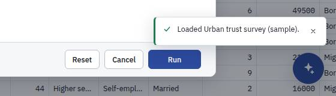
- **Suspected:** `src/app/Overlays.tsx` (Toasts) and the toast z-index in src/app/app.css; .modal-backdrop is z-index 100
- **Crawler:** rule `occluded`, 2 finding(s) in 10 combination(s): key `a1aab9bb7b` key `f1181716b0`

### UI-002 [P1] Text coding: the "Documents" view cannot be opened when the project has only survey responses

- **Area:** text coding
- **Where:** all viewports and themes (coding state)
- **Steps:**
  1. Load the sample survey.
  2. Text coding tab > Explore a worked example.
  3. Click the "Documents" view tab.
- **Expected:** Documents opens (an empty list with "Import documents" help), or the tab is disabled with a tooltip saying there are no documents yet.
- **Actual:** The click is swallowed: the selection jumps straight back to "Responses", with no message. It looks like a broken tab.
- **Screenshot:** 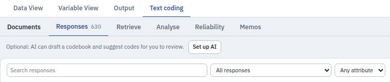
- **Suspected:** `src/features/coding/CodingWorkspace.tsx` (the effect that redirects view "documents" to "responses" when nDocuments is 0)
- **Crawler:** rule `dead-control`, 1 finding(s) in 2 combination(s): key `4813e95d6e`

### UI-003 [P1] AI status says "ready" as soon as a key is typed, and stays "ready" after the connection test fails

- **Area:** AI/assistant
- **Where:** 1440×900 light (all sizes)
- **Steps:**
  1. AI > AI assistant settings...
  2. Choose "Google Gemini".
  3. Paste any made-up key (for example AIzaFAKEKEY...), click "Test connection".
  4. Close the dialog and look at the AI chip in the top bar; click it.
- **Expected:** The chip says "not connected" / "check settings" until a test (or a first real request) succeeds; the popover repeats the failed test result.
- **Actual:** The test correctly says "Not connected. The steps below show where it failed", but the chip turns to "AI Gemini" (data-ready="yes", label "AI help: ready (Google Gemini ...)") the moment the key is typed, and the popover says "Ready: Google Gemini". The researcher is told AI is ready and only finds out when an AI feature fails. This is the most likely cause of the owner's "AI connection" report.
- **Screenshot:** 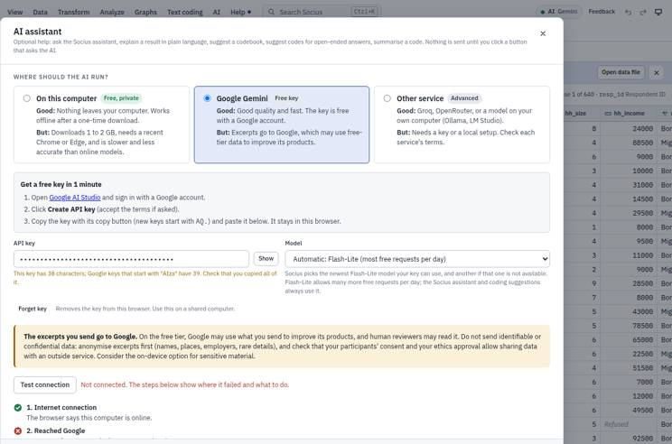
- **Suspected:** `src/platform/ai.ts` (refreshAiStatus / providerReady: "ready" means a key is present, not that the last test or request succeeded) and src/features/ai/AiSettingsDialog.tsx
- **Crawler:** rule `owner-report`, 1 finding(s) in 1 combination(s): key `dd1828a271`

### UI-004 [P1] Menus: after using the arrow keys, the keyboard highlight stays while the mouse highlights another item (two items look selected)

- **Area:** shell/menus/search/help
- **Where:** every viewport with a menubar (1440 to 768), both themes
- **Steps:**
  1. Click the "Analyze" menu.
  2. Press ArrowDown twice.
  3. Move the mouse onto a different item (for example "Regression").
- **Expected:** One highlighted item: the one under the pointer (moving the pointer should move the active item, as in desktop menus).
- **Actual:** Two items are highlighted at once: the focused one (keyboard) and the hovered one. Part of the owner's "hover does not follow the pointer" report.
- **Screenshot:** 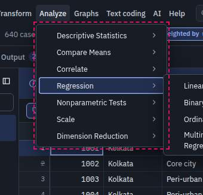
- **Suspected:** `src/ui/Menu.tsx` (menu items style :hover and :focus-visible separately; focus should follow mouseenter) and src/app/app.css .menu-item:hover/.menu-item:focus-visible
- **Crawler:** rule `menu-hover`, 2 finding(s) in 22 combination(s): key `f1159ba053` key `569f8f706b`

### UI-005 [P1] Keyboard focus is lost after closing a dialog opened from a menu (focus falls to the page body)

- **Area:** shell/menus/search/help
- **Where:** all viewports and themes
- **Steps:**
  1. With the mouse, choose Analyze > Descriptive Statistics > Frequencies... (or any of the 40+ dialogs listed by the crawler).
  2. Press Escape.
  3. Press Tab.
- **Expected:** Focus returns to where the user was (the menu title, or the Data View cell they were on), so the next Tab or arrow key continues from there.
- **Actual:** Focus goes to <body>; the next Tab starts again from "Skip to content". Affects all analysis, transform, chart, file and coding dialogs opened from the menus, the "Close everything?" confirm and Recent projects. Help dialogs (Getting started, Keyboard shortcuts, Send feedback, About, Error log) and AI assistant settings instead send focus to the floating assistant button.
- **Suspected:** `src/app/MenuBar.tsx` restores focus to "where it was before the menu opened" (often <body> after a mouse click); src/ui/Modal.tsx then captures that as the element to return to
- **Crawler:** rule `focus-return`, 43 finding(s) in 49 combination(s): key `90af240f96` key `7bdf387520` key `5690330b41` key `8f8e3eae09` key `b5ca5b08c9` key `49f77dbe90` key `9a5a6e5fd7` key `74e890fd92` key `332305785e` key `6e5c987637` key `55ff113d0f` key `c68899bae9` (+31 more)

### UI-006 [P1] Error log dialog opened from About: focus stays outside the dialog and Tab leaves it

- **Area:** shell/menus/search/help
- **Where:** all viewports
- **Steps:**
  1. Help > About Socius.
  2. Click the "Help > Error log" link in the dialog.
  3. Press Tab a few times.
- **Expected:** Focus moves into the Error log dialog and Tab cycles inside it.
- **Actual:** Focus stays on the page (the body or the assistant button) and Tab walks through the page behind the dialog (toasts, inputs). The About dialog closing restores focus after the Error log dialog has already focused itself.
- **Screenshot:** 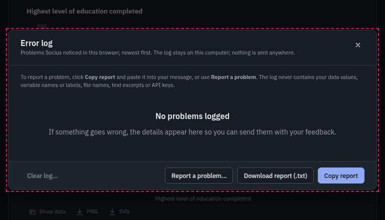
- **Suspected:** `src/ui/Modal.tsx` (cleanup of the closing dialog steals focus from the one that replaces it) and src/features/errorlog/ErrorLogDialog.tsx
- **Crawler:** rule `focus-trap`, 4 finding(s) in 24 combination(s): key `f6668e5090` key `36bac9131a` key `138045ecde` key `336fb87660`

### UI-007 [P1] The assistant panel covers the top bar; at 768–1024 px it also covers the menubar and search

- **Area:** AI/assistant
- **Where:** 1440×900 to 768×1024, both themes (at 400 px a full-screen panel is expected)
- **Steps:**
  1. Press Ctrl+J (or click the round assistant button).
  2. Try to click Undo, Redo, the theme button or the AI chip; at 1024 px also try "Graphs", "AI", "Help" or Search.
- **Expected:** The panel sits below the top bar (or pushes the page), so the top bar stays usable while the assistant is open.
- **Actual:** The panel is drawn over the right part of the top bar (from y = 0): Undo, Redo, theme, Feedback and the AI chip cannot be clicked while it is open; at 1024 and 768 px it also hides Graphs, Text coding, AI, Help and Search.
- **Screenshot:** 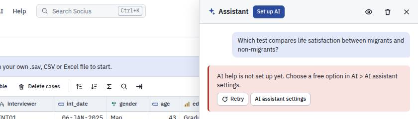
- **Suspected:** `src/features/assistant/assistant.css` (.as-panel top/z-index)
- **Crawler:** rule `occluded`, 2 finding(s) in 35 combination(s): key `47abc011a4` key `eeb3fffd34`

### UI-008 [P1] Coder menu opens off the left edge of the screen at 1024 px and narrower

- **Area:** text coding
- **Where:** 1024×768, 768×1024, 400×800
- **Steps:**
  1. Text coding worked example at 1024×768 (or 400×800).
  2. Click "Coder: Coder 1 ▾" in the coding toolbar.
- **Expected:** The menu opens fully on screen (aligned to the button's right edge when there is no room on the left).
- **Actual:** The menu is positioned at x = -113 px: its left part, including the item labels ("... (coding now)", "Show only my segments"), is cut off.
- **Screenshot:** 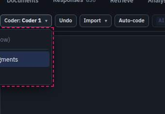
- **Suspected:** `src/features/coding/ui.tsx` (cw-menu-list positioning / cw-menu-left)
- **Crawler:** rule `popup-offscreen`, 2 finding(s) in 5 combination(s): key `c2f2cf1cdb` key `4c67f30977`

### UI-009 [P1] The floating assistant button covers codebook controls at tablet width

- **Area:** text coding
- **Where:** 768×1024, 1024×768
- **Steps:**
  1. Text coding worked example at 768×1024 or 1024×768.
  2. Scroll the codebook so a code row is at the bottom right.
  3. Try to click the code's actions button, "More ▾" or a code's remove "×".
- **Expected:** The round button leaves room (the page reserves space for it) or moves out of the way.
- **Actual:** The button sits on top of "Code actions", "More ▾" and "Remove <code>" at the bottom right; clicks open the assistant instead.
- **Screenshot:** 
- **Suspected:** `src/features/assistant/AssistantRoot.tsx` / assistant.css (.as-fab) and src/features/coding/coding.css (no bottom padding for the FAB)
- **Crawler:** rule `occluded`, 1 finding(s) in 4 combination(s): key `70323501a1`

### UI-010 [P1] Regression interpretation mixes variable labels and names in one sentence

- **Area:** output
- **Where:** any
- **Steps:**
  1. Run Analyze > Regression > Linear Regression with life_sat as dependent, age and yrs_nbhd as predictors.
  2. Read "What this means".
- **Expected:** One naming style: labels (or names) throughout.
- **Actual:** "The model explains 5.5% of the variation in life_sat ... each one-unit increase in Age in completed years is associated with ... Each one-unit increase in yrs_nbhd ...": the outcome and one predictor use the name, the other predictor its label. A researcher copying it into a paper has to rewrite it.
- **Screenshot:** 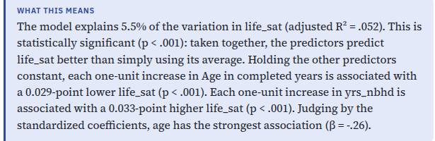
- **Suspected:** `src/procedures/models/linear.ts` (interpretation text)
- **Crawler:** manual finding (not machine-checkable).

### UI-011 [P2] Menus switch when the pointer moves diagonally from a menu title towards its items

- **Area:** shell/menus/search/help
- **Where:** every viewport with a menubar
- **Steps:**
  1. Click "File".
  2. Move the pointer in a straight line from "File" to the middle of "New dataset" (the natural path crosses "Edit").
- **Expected:** The File menu stays open while the pointer is heading into it (a short hover delay or "safe triangle", as desktop menubars do).
- **Actual:** The pointer crosses the "Edit" title on the way down and the Edit menu replaces File, so the item the user was aiming at disappears. Feels like "hover does not follow the pointer".
- **Screenshot:** 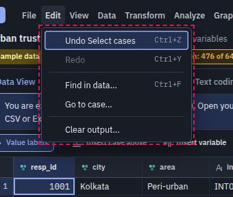
- **Suspected:** `src/app/MenuBar.tsx` (onMouseEnter of .menubar-btn switches immediately)
- **Crawler:** rule `menu-hover`, 1 finding(s) in 32 combination(s): key `e764c77090`

### UI-012 [P2] Search: pressing Enter on a command that needs data does nothing

- **Area:** shell/menus/search/help
- **Where:** first visit, all viewports
- **Steps:**
  1. First visit (no data).
  2. Ctrl+K, type "frequencies", press Enter.
- **Expected:** Enter explains why ("Open or create a dataset first", with a button) or opens the Welcome actions.
- **Actual:** Nothing happens: the palette stays open. The hint "Open or create a dataset first" is shown in small text under the command, but Enter gives no feedback.
- **Screenshot:** 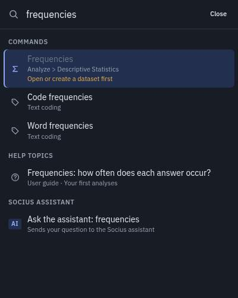
- **Suspected:** `src/app/CommandPalette.tsx` (run of a disabled entry)
- **Crawler:** rule `dead-control`, 1 finding(s) in 10 combination(s): key `91175528f4`

### UI-013 [P2] No visible focus ring in the variable search boxes of Select Cases, Compute Variable and Weight Cases

- **Area:** transforms
- **Where:** all viewports, both themes
- **Steps:**
  1. Data > Select cases...
  2. Press Tab until the "Search" box in the Variables list has focus.
- **Expected:** A visible focus ring, like other inputs.
- **Actual:** The box looks exactly the same focused and unfocused (outline, shadow and border unchanged).
- **Screenshot:** 
- **Suspected:** `src/ui/VarPicker.tsx` (.varpicker-input: outline none without a replacement)
- **Crawler:** rule `focus-ring`, 3 finding(s) in 18 combination(s): key `e58968f07a` key `fba5184b70` key `b5e4183caf`

### UI-014 [P2] Low-contrast "faint" text (2.4–2.9:1) in light and dark themes

- **Area:** theme
- **Where:** all viewports; light (rgb 138,148,163 on 238–249 grey) and dark (rgb 109,119,135 on navy)
- **Steps:**
  1. Look at: the "630" count on the Responses tab, "None" in Variable View Values/Missing of a selected row, times and counts in the Output outline, row numbers of filtered-out cases, "(n = 388)" in Analyse tables, co-occurrence cells.
- **Expected:** At least 3:1 for secondary text (4.5:1 for body text under WCAG AA).
- **Actual:** Measured 2.40:1 to 2.92:1 across a dozen places; white on light blue in the co-occurrence heat map is 2.74:1.
- **Screenshot:** 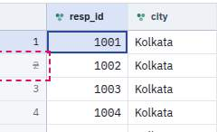
- **Suspected:** `src/styles/tokens.css` (--faint in both themes); src/features/coding/coding.css (.cw-heat cell colours)
- **Crawler:** rule `contrast`, 11 finding(s) in 19 combination(s): key `5728ffbdbe` key `d6f224de0e` key `bf86e9a861` key `5b3bb0d839` key `ba1f863165` key `4c7508f0fb` key `339982394b` key `a332f42b1d` key `226b748ea2` key `9611666e19` key `f36c49d2fb`

### UI-015 [P2] Truncated text with no way to see it in full (no tooltip)

- **Area:** data
- **Where:** all viewports
- **Steps:**
  1. Data View: look at long value labels ("Unemployed, looking for work", "Postgraduate") in a narrow column.
  2. Output outline: long item titles ("Linear Regression: All things considered, how sati...").
  3. Text coding > Auto-code: long code names.
- **Expected:** Hovering shows the full text (title attribute), or the column/outline can be widened.
- **Actual:** Text is cut with an ellipsis and no tooltip.
- **Screenshot:** 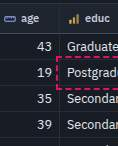
- **Suspected:** `src/features/data/DataGrid.tsx` (.grid-cell), src/features/output/OutputViewer.tsx (.ov-outline-block), src/features/coding/dialogs/AutoCodeDialog.tsx
- **Crawler:** rule `overflow-text`, 5 finding(s) in 34 combination(s): key `b2f0ad2a6d` key `4182d27d89` key `e07be97c97` key `ed5474a952` key `4d108fb767`

### UI-016 [P2] Disabled items without a reason in the Coder menu

- **Area:** text coding
- **Where:** all viewports
- **Steps:**
  1. Text coding worked example.
  2. Click "Coder: Coder 1 ▾".
- **Expected:** Disabled items say why (title).
- **Actual:** "Coder 1 (coding now)" is disabled with no tooltip.
- **Screenshot:** 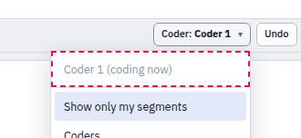
- **Suspected:** `src/features/coding/ui.tsx` / CodingWorkspace.tsx (coder menu)
- **Crawler:** rule `disabled-no-reason`, 1 finding(s) in 2 combination(s): key `05228b6c00`

### UI-017 [P2] Home screen: the tab bar still marks another view as current

- **Area:** shell/menus/search/help
- **Where:** all viewports
- **Steps:**
  1. Load the sample survey, click the Output tab.
  2. Click the Socius logo (Home).
- **Expected:** No tab is marked (or a "Home" state is shown) while the start screen is open.
- **Actual:** The start screen is shown but "Output" (or whichever tab was open) stays underlined, so it is unclear where you are.
- **Screenshot:** 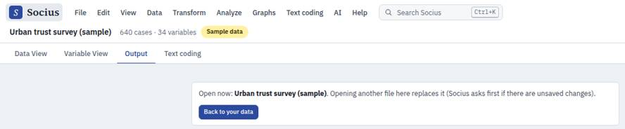
- **Suspected:** `src/app/App.tsx` / src/app/TopBar.tsx (home state vs. tab)
- **Crawler:** rule `flow`, 1 finding(s) in 2 combination(s): key `3980b6acd5`

### UI-018 [P2] Worked-example toast is long, disappears after 4.4 s and covers the codebook counts

- **Area:** text coding
- **Where:** 1440×900
- **Steps:**
  1. Text coding > Explore a worked example.
- **Expected:** Instructions this long belong in the note on the page (which exists) or stay until dismissed.
- **Actual:** A 50-word "Example loaded ... Then try Analyse > Codes by attribute, or Export > ..." toast covers the codebook counts and "+ code" buttons and vanishes after about 4.4 s, before it can be read.
- **Screenshot:** 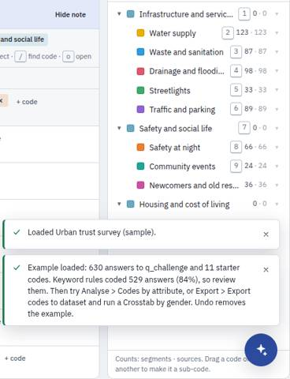
- **Suspected:** `src/features/coding/CodingWorkspace.tsx` (exploreExample toast)
- **Crawler:** manual finding (not machine-checkable).

### UI-019 [P2] Code frequencies: parent themes show 0 segments / 0.0% with an empty bar

- **Area:** text coding
- **Where:** any
- **Steps:**
  1. Text coding worked example > Analyse > Code frequencies.
- **Expected:** Parent rows show the aggregated count (the "Incl. sub-codes" number) or are visually marked as groups.
- **Actual:** "Infrastructure and services 0 0 0.0%" with an empty bar, and the real total (367, 58.3%) only in the far-right "Incl. sub-codes" column. Easy to misread as "nobody mentioned infrastructure".
- **Screenshot:** 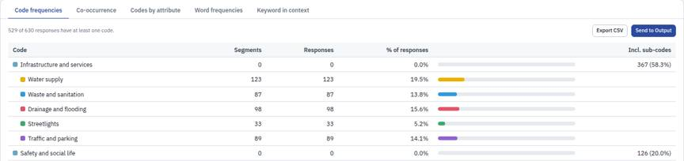
- **Suspected:** `src/features/coding/AnalyseView.tsx`
- **Crawler:** manual finding (not machine-checkable).

### UI-020 [P2] Assistant accepts a question when AI is not set up, then offers a useless "Retry"

- **Area:** AI/assistant
- **Where:** any
- **Steps:**
  1. AI not set up. Press Ctrl+J, type a question, click Send.
- **Expected:** Send is replaced by "Set up AI" (the header already has it), or the message explains before sending.
- **Actual:** The question is posted, then an error bubble says AI is not set up, with a "Retry" button that can only fail again.
- **Screenshot:** 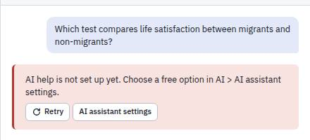
- **Suspected:** `src/features/assistant/AssistantPanel.tsx`
- **Crawler:** manual finding (not machine-checkable).

### UI-021 [P2] A failed AI connection test is logged as an app error (Help menu gets a red dot)

- **Area:** AI/assistant
- **Where:** any
- **Steps:**
  1. AI > AI assistant settings... > Google Gemini, made-up key, Test connection.
  2. Close; open Help.
- **Expected:** An expected test failure is shown in the dialog only.
- **Actual:** Help shows a "new problems" dot and Help > Error log lists "Error · AI · Could not reach the AI service."
- **Suspected:** `src/features/errorlog/` (logging from the test-connection path)
- **Crawler:** manual finding (not machine-checkable).

### UI-022 [P2] Clicking the dimmed area around a dialog closes it and discards the selections

- **Area:** analysis dialogs
- **Where:** any
- **Steps:**
  1. Open Frequencies, move three variables into the box, tick some statistics.
  2. Click anywhere on the dimmed page (for example where the round assistant button shows through, bottom right).
- **Expected:** Analysis dialogs with user input close only with Cancel/Escape (as in SPSS), or ask first.
- **Actual:** The dialog closes and the choices are lost. The dimmed assistant button still looks clickable, which invites exactly this click.
- **Suspected:** `src/ui/Modal.tsx` (backdrop onMouseDown closes)
- **Crawler:** manual finding (not machine-checkable).

### UI-023 [P2] Phone: Text coding view tabs are cut off with no scroll hint

- **Area:** mobile
- **Where:** 400×800
- **Steps:**
  1. 400×800: Text coding tab.
- **Expected:** Tabs wrap, or a fade / arrow shows there are more.
- **Actual:** "Reliabili..." is cut at the right edge and "Memos" is not visible; nothing indicates the row scrolls.
- **Screenshot:** 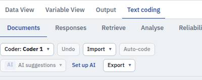
- **Suspected:** `src/features/coding/coding.css` (.cw-viewtabs)
- **Crawler:** manual finding (not machine-checkable).

### UI-024 [P2] Tablet: the Data View status text is clipped at the right edge

- **Area:** data
- **Where:** 768×1024
- **Steps:**
  1. 768×1024, Data View.
- **Expected:** The status ("Case 1 of 640 · resp_id Respondent ID") shortens or wraps.
- **Actual:** It is cut mid-word ("Case 1 of 640 · resp_") at the right edge of the toolbar.
- **Screenshot:** 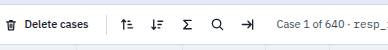
- **Suspected:** `src/features/data/DataView.tsx` (.toolbar-status)
- **Crawler:** manual finding (not machine-checkable).

### UI-025 [P2] Tablet: View > Variable list is ticked but the variable list is hidden, and toggling it does nothing

- **Area:** mobile
- **Where:** 768×1024 (all widths below 900 px)
- **Steps:**
  1. 768×1024 (anything under 900 px wide), sample survey loaded, Data View.
  2. Open View: "Variable list" shows a check mark.
  3. Choose it twice.
- **Expected:** The variable list opens (as an overlay drawer on narrow screens), or the item is disabled with "Needs a wider window".
- **Actual:** The sidebar is hidden by CSS below 900 px whatever the setting; the menu item flips its check mark but nothing appears. On a tablet the only way to see variable labels is Variable View.
- **Suspected:** `src/app/app.css` (@media (max-width: 900px) .sidebar { display: none }) and src/app/menus.ts (v-side)
- **Crawler:** manual finding (not machine-checkable).

### UI-026 [P2] Charts have no APA figure number, and the chart title repeats the item title

- **Area:** charts
- **Where:** any
- **Steps:**
  1. Graphs > Bar Chart..., educ, Run.
  2. Look at the result in Output (APA tables on).
- **Expected:** APA style: "Figure 1" and an italic title above the chart (tables already get "Table N"), and the title once.
- **Actual:** Tables are numbered ("Table 11 · Values shown in the chart") but the chart itself is not; "Highest level of education completed" appears as the item title and again as the chart title. Word export inherits this.
- **Screenshot:** 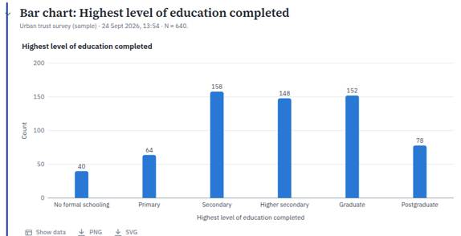
- **Suspected:** `src/features/output/OutputViewer.tsx` and src/features/output/exportDocx.ts (figure numbering)
- **Crawler:** manual finding (not machine-checkable).

### UI-027 [P2] Deleting an Output result gives no confirmation and no undo hint

- **Area:** output
- **Where:** any
- **Steps:**
  1. Run two analyses.
  2. In Output, click the bin icon of the first result.
- **Expected:** A toast "Result deleted. Undo" (Data View deletions already say "Press Ctrl+Z to undo").
- **Actual:** The result disappears silently. Ctrl+Z does bring it back, but nothing tells the user.
- **Suspected:** `src/features/output/actions.ts` / OutputViewer.tsx (delete)
- **Crawler:** manual finding (not machine-checkable).

### UI-028 [P2] Select Cases opens with focus on "All cases (turn the filter off)" although another option is selected

- **Area:** transforms
- **Where:** any
- **Steps:**
  1. Data > Select cases...
  2. Look at which radio button has the focus ring; press Space.
- **Expected:** Focus on the selected option (or on the Condition box).
- **Actual:** Focus is on the unselected "All cases (turn the filter off)" radio; Space switches the choice to it.
- **Screenshot:** 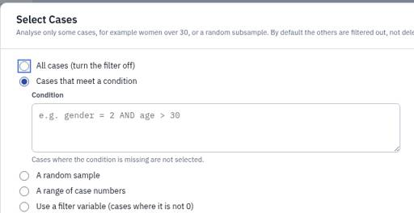
- **Suspected:** `src/features/transform/CasesDialogs.tsx` (initial focus); src/ui/Modal.tsx focuses the first input
- **Crawler:** manual finding (not machine-checkable).

### UI-029 [P2] Worked example wording does not match the app ("11 starter codes" vs 15 in the codebook; menu names differ)

- **Area:** text coding
- **Where:** any
- **Steps:**
  1. Text coding > Explore a worked example; read the toast, the note and the memo "About this worked example".
- **Expected:** Counts and command names match what is on screen.
- **Actual:** The toast and memo say "11 starter codes" while the codebook header says 15 (4 themes + 11 codes). The memo says "Export > Codes to dataset variables", the toast "Export > Export codes to dataset", the menu item is "Export codes to dataset...".
- **Screenshot:** 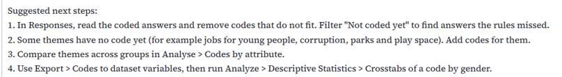
- **Suspected:** `src/lib/coding/example.ts,` src/features/coding/CodingWorkspace.tsx
- **Crawler:** manual finding (not machine-checkable).

### UI-030 [P2] Dates are formatted three different ways

- **Area:** shell/menus/search/help
- **Where:** any
- **Steps:**
  1. Run an analysis; open Text coding > Memos in the worked example.
- **Expected:** One date format (the Output one, "24 Sept 2026, 13:54", reads well internationally).
- **Actual:** Output: "24 Sept 2026, 13:54"; memo list: "9/24/2026"; memo footer: "9/24/2026, 1:58:18 PM" (US order, 12-hour clock).
- **Suspected:** `src/features/coding/MemosView.tsx` (toLocaleDateString without options) vs src/features/output/format.ts
- **Crawler:** manual finding (not machine-checkable).


## Exploratory findings the crawler cannot judge

These come from using the app as a researcher would. They are wording, flow and consistency problems; several are listed above as bugs too (marked with their ID).

### Output

- Regression "What this means" mixes names and labels (UI-010).
- The T test "Group Statistics" table uses the full question text ("All things considered, how satisfied are you with your life as a whole these days? (0-10)") as the row label, which wraps into five lines; the variable name or a shortened label would read better in an APA table.

### Text coding

- The coding toolbar has its own "Undo" next to the top-bar Undo; the toast says "Undo removes the example" without saying which one. Label it "Undo coding" or merge.
- "Optional: AI can draft a codebook..." banner plus a "Set up AI" button in the toolbar plus a disabled "AI suggestions" menu: three AI prompts in one row when AI is not set up.
- Reliability with one coder is an empty page with "Add a coder": fine, but the tab could say "(needs 2 coders)" so people do not open it expecting results.

### Data and variables

- After Recode into different variables, the new variable is added at the end but the grid does not scroll to it or select it; the toast has no "Show" action. Researchers usually want to add value labels next.
- Recode rules: with no rule, OK shows "Add at least one rule with the Add button" (good), but "Values without a rule become missing" is only small print; adding "All other values → Copy old value" as a default suggestion would prevent accidental missing data.
- The variable list in the Recode dialog uses custom rows with a check-box look (role=option) rather than real check boxes, so the "checkbox" does not behave like one for screen readers.
- Data View cells truncate labels ("Employed...", "Postgradu...") with no tooltip; the status bar shows the full label only for the current cell.

### Dialogs and shell

- Toasts sit above dialogs (UI-001); long-lived toasts also stack three deep after weighting on/off.
- Clicking the dimmed backdrop closes analysis dialogs and loses the selection (UI-022).
- Search is good (commands, variables with quick actions, help topics, assistant) but pressing Enter on a greyed command is silent (UI-012).
- The Keyboard shortcuts dialog is thorough and matched the behaviour seen while testing.

### AI and assistant

- Settings dialog: clear provider cards and a key-length check before testing; the step-by-step "Test connection" diagnosis is excellent. But the status chip trusts any typed key (UI-003).
- On-device option in a browser without a usable GPU: the explanation is long and technical (chrome://gpu, Wayland, driver block lists); a one-line summary with "Show details" would help non-technical users.
- The assistant is reachable three ways (Ctrl+J, AI menu, round button) and the chip popover; good, but while open it hides the top bar (UI-007).

### Phone and tablet

- At 400 px the Menu sheet, dialogs (full screen) and Data View work; the sample-data banner's close button wraps onto its own line.
- Coding tabs clipped (UI-023); coder menu off-screen (UI-008); the variable list cannot be shown below 900 px (UI-025).


## How to re-run and verify fixes

```bash
node scripts/crawl/run.mjs                 # everything: 50 combinations, about 45 minutes with 3 workers
node scripts/crawl/run.mjs --quick         # 1440x900 + 400x800, light, shallow: about 10 minutes
node scripts/crawl/run.mjs --area "text coding"            # one area (data, variables, transforms, "analysis dialogs",
                                                            # output, charts, "text coding", ai, shell, mobile, theme)
node scripts/crawl/run.mjs --state sample --viewport 400x800 --theme dark
node scripts/crawl/run.mjs --react-dev     # also crawl a development React build (React warnings)
node scripts/crawl/run.mjs --report-only   # rebuild the report from the last raw results
```

The runner builds the app into `/tmp/crawl/dist`, serves it under `/socius/` on a free port from 4391 (`scripts/crawl/serve.mjs`), runs `npx playwright test -c scripts/crawl/playwright.crawl.config.ts` (the normal `npx playwright test` never picks it up: its config only looks in `e2e/`), and writes:

- `docs/qa/crawl-report.json`: every finding with key, rule, priority, area, selector, reproduction steps, all combinations where it was seen, screenshot, plus coverage and the owner-report verdicts;
- `docs/qa/CRAWL-FINDINGS.md`: the same as a readable list with a summary table;
- `docs/qa/crawl-diff.md`: new / fixed / still present compared with the previous report, and a status line for every UI-### above that names a crawler key.

A partial run (`--area`, `--state`, ...) only replaces findings inside what it covered; the rest of the previous report is carried over. A shallower run (`--quick`, or any size other than 1440×900 light, which is crawled at full depth) never marks a finding from a deeper run as fixed: the report keeps the depth per combination. Keys are stable across runs (hash of rule, area, a normalised selector and message), so a fix shows up as "fixed" in the diff. Screenshots are small JPEGs in `docs/qa/shots/` (`c-*` from the crawler, pruned when no longer referenced; `m-*` from exploratory testing).

What the crawler does per state and viewport: opens every menu and submenu item with real pointer moves (the Menu sheet below 760 px), every dialog they open (then every tab and every safe control in it, cancelling destructive ones and intercepting file pickers, downloads and new tabs), every toolbar button, the right-click menus in Data View and Variable View, search (Ctrl+K) with several queries, the AI chip popover, the assistant (Ctrl+J), Help, the Output item actions and the Text coding views. After each step it checks: page errors, console errors/warnings, failed requests, sideways scrolling, clipped text and labels, overlapping controls, controls covered by something else (elementFromPoint), text contrast below 3:1, disabled items without a reason, dialogs larger than the screen, popups off-screen, focus trap / Escape / focus return / visible focus ring, menu closing (outside click, Escape, tab switch, choosing), hover following the pointer, two menus at once, dead controls (no DOM change, no effect), slow responses (over 1 s) and layout shift. Known limits: contrast is computed against the nearest solid background (gradients and images are skipped); "dead control" means no DOM change within about a second.
